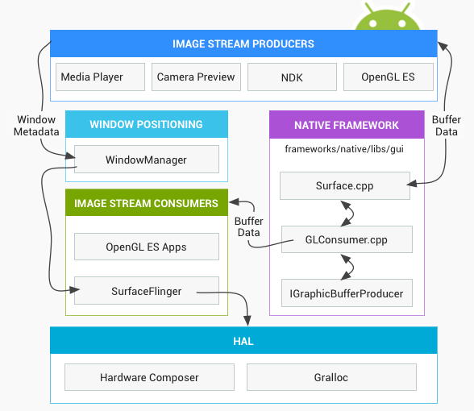
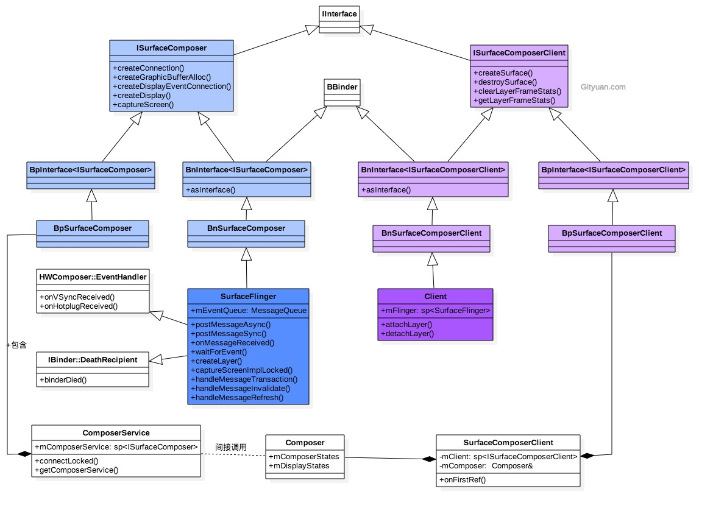
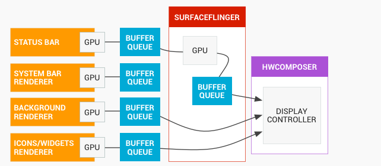
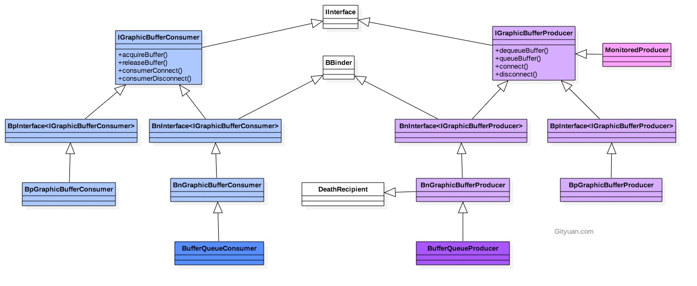

> 基于Android 6.0源码， 简述Android图形系统

    frameworks/native/services/surfaceflinger/
    frameworks/native/libs/gui/

## 一. 概述

Android系统中图形系统是相当复杂的，包括WindowManager，SurfaceFlinger,Open GL,GPU等模块。
其中SurfaceFlinger作为负责绘制应用UI的核心，从名字可以看出其功能是将所有Surface合成工作。
不论使用什么渲染API, 所有的东西最终都是渲染到"surface". surface代表BufferQueue的生产者端, 并且
由SurfaceFlinger所消费, 这便是基本的生产者-消费者模式. Android平台所创建的Window都由surface所支持,
所有可见的surface渲染到显示设备都是通过SurfaceFlinger来完成的.

### 1.1 图形架构

图解: 

1. Image Stream Producers(图形流的生产者): 可产生graphic buffers的生产者. 例如OpenGL ES, Canvas 2D, mediaserver的视频解码器.
2. Image Stream Consumers(图形流的消费者): 最场景的消费者便是SurfaceFlinger,它使用OpenGL和Hardware Composer来组合一组surfaces.
    - OpenGL ES应用能消费图形流, 比如camera app消费camera预览图形流;
    - 非OpenGL ES应用也能消费,   比如ImageReader类
3. Window Manager: 用于管理window, 这是一组view的容器. WM将手机的window元数据(包括屏幕放心,z-order等)信息发送给SurfaceFlinger,因此SurfaceFlinger
能使用这些信息来合成surfaces,并输出到显示设备.
4. Hardware Composer(硬件合成器): 这是显示子系统的硬件抽象层, SurfaceFlinger能将一些合成工作委托给Hardware Composer,从而降低来自OpenGL和GPUd的负载.
5. Gralloc: 全称为graphics memory allocator,图像内存分配器, 用于图形生产这来请求分配内存.

(参考：https://source.android.com/devices/graphics/index.html）

### 1.2 SurfaceFlinger

SurfaceFlinger进程是由init进程创建的，运行在独立的SurfaceFlinger进程。Android应用程序
必须跟SurfaceFlinger进程交互，才能完成将应用UI绘制到frameBuffer(帧缓冲区)。这个交互便涉及到
进程间的通信，采用的Binder IPC方式，名为"SurfaceFlinger"的Binder服务端运行在[SurfaceFlinger进程](https://panard313.github.io/2017/02/11/surface_flinger/)。

SurfaceFlinger关系图：点击查看[大图](https://panard313.github.io/images/surfaceFlinger/class_surface.jpg)

Client，SurfaceFlinger这两个Binder服务运行在SurfaceFlinger进程.
SurfaceComposerClient对象的两个成员变量分别跟着两个Binder服务通信：

- 其成员变量mClient通过Binder调用Client服务，
- 其成员变量mComposer经过Composer(位于SurfaceComposerClient.cpp文件)，ComposerService对象，再通过Binder调用SurfaceFlinger。

也就是说只需要调用`new SurfaceComposerClient()`便建立应用程序跟SurfaceFlinger服务建立连接，
获取了其中两个Binder的代理类。每一个app在SurfaceFlinger中都有一个Client对象相对应。

当app来到前台的执行流程：

1. WMS会请求SurfaceFlinger来绘制surface. 
2. SurfaceFlinger创建layer;
3. 一个生产者的Binder对象通过WMS传递给app, 因此app可以直接向SurfaceFlinger发送帧信息.

对于大多数的app来说都有3个layers: 状态栏,导航栏, 应用UI. 每一个layer都是独立更新的.
状态栏和导航栏是由系统进程负责渲染, app层是由app自己渲染,两者直接并没有协作. 

## 二. 图形处理

### 2.1 图形数据流

图中最左侧是指渲染器,用于生产graphics buffers, 比如状态栏,systemUI等. 再来看看图中BufferQueue的工作

### 2.2 生成者消费者模式

 

图解:

生产者和消费者运行在不同的进程.

- 生产者请求一块空闲的缓存区:dequeueBuffer()
- 生产者填充缓存区并返回给队列: queueBuffer()
- 消费者获取一块缓存区: acquireBuffer()
- 消费者使用完毕,则返回给队列: releaseBuffer()

再从类图的角度来看看：点击查看[大图](https://panard313.github.io/images/surfaceFlinger/class_buffer_queue.jpg)

再简单讲到这里，后续再展开详细讲解。
