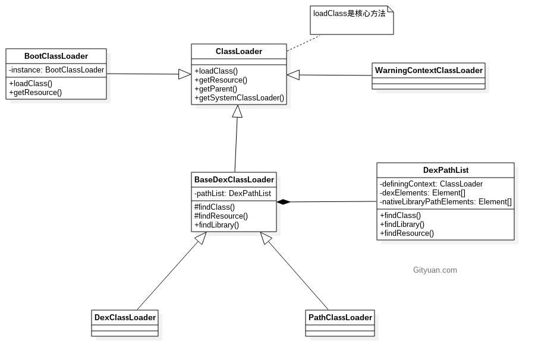

>  本文讲述的Android系统体系架构，说一说ClassLoader加载过程

## 一. 概述

Android从5.0开始就采用art虚拟机, 该虚拟机有些类似Java虚拟机, 程序运行过程也需要通过ClassLoader
将目标类加载到内存.

传统Jvm主要是通过读取class字节码来加载, 而art则是从dex字节码来读取. 这是一种更为优化的方案,
可以将多个.class文件合并成一个classes.dex文件. 下面直接来看看ClassLoader的关系

### 1.1 架构图

## 二. ClassLoader构造函数

### 2.1 PathClassLoader

    public class PathClassLoader extends BaseDexClassLoader {

        public PathClassLoader(String dexPath, ClassLoader parent) {
            super(dexPath, null, null, parent);
        }

        public PathClassLoader(String dexPath, String libraryPath,
                ClassLoader parent) {
            super(dexPath, null, libraryPath, parent);
        }
    }

PathClassLoader比较简单, 继承于BaseDexClassLoader. 封装了一下构造函数, 默认
optimizedDirectory=null.

### 2.2 DexClassLoader

    public class DexClassLoader extends BaseDexClassLoader {

        public DexClassLoader(String dexPath, String optimizedDirectory,
                String libraryPath, ClassLoader parent) {
            super(dexPath, new File(optimizedDirectory), libraryPath, parent);
        }
    }

DexClassLoader也同样,只是简单地封装了BaseDexClassLoader对象,并没有覆写父类的任何方法.

### 2.3 BaseDexClassLoader

    public class BaseDexClassLoader extends ClassLoader {
        private final DexPathList pathList;

        public BaseDexClassLoader(String dexPath, File optimizedDirectory,
            String libraryPath, ClassLoader parent) {
            super(parent);
            //[见小节2.3.1]
            this.pathList = new DexPathList(this, dexPath, libraryPath, optimizedDirectory);
        }
    }

BaseDexClassLoader构造函数, 有一个非常重要的过程, 那就是初始化DexPathList对象.

另外该构造函数的参数说明:

- dexPath: 包含目标类或资源的apk/jar列表;当有多个路径则采用:分割;
- optimizedDirectory: 优化后的dex文件存在的目录, 可以为null;
- libraryPath: native库所在路径列表;当有多个路径则采用:分割;
- ClassLoader:父类的类加载器.

#### 2.3.1 DexPathList

    public DexPathList(ClassLoader definingContext, String dexPath,
            String libraryPath, File optimizedDirectory) {
        ...
        this.definingContext = definingContext;

        ArrayList<IOException> suppressedExceptions = new ArrayList<IOException>();
        //记录所有的dexFile文件
        this.dexElements = makePathElements(splitDexPath(dexPath), optimizedDirectory, suppressedExceptions);

        //app目录的native库
        this.nativeLibraryDirectories = splitPaths(libraryPath, false);
        //系统目录的native库
        this.systemNativeLibraryDirectories = splitPaths(System.getProperty("java.library.path"), true);
        List<File> allNativeLibraryDirectories = new ArrayList<>(nativeLibraryDirectories);
        allNativeLibraryDirectories.addAll(systemNativeLibraryDirectories);
        //记录所有的Native动态库
        this.nativeLibraryPathElements = makePathElements(allNativeLibraryDirectories, null,
                                                          suppressedExceptions);
        ...
    }

DexPathList初始化过程,主要功能是收集以下两个变量信息:

1. dexElements: 记录所有的dexFile文件
2. nativeLibraryPathElements: 记录所有的Native动态库, 包括app目录的native库和系统目录的native库.

### 2.4  BootClassLoader

    class BootClassLoader extends ClassLoader {
        private static BootClassLoader instance;

        public static synchronized BootClassLoader getInstance() {
            if (instance == null) {
                instance = new BootClassLoader();
            }

            return instance;
        }

        public BootClassLoader() {
            super(null, true);
        }
}

以上所有的ClassLoader都直接或间接着继承于抽象类ClassLoader.

### 2.5 ClassLoader

    public abstract class ClassLoader {
        private ClassLoader parent;

        protected ClassLoader() {
            //[见小节2.5.1]
            this(getSystemClassLoader(), false);
        }

        protected ClassLoader(ClassLoader parentLoader) {
            this(parentLoader, false);
        }

        ClassLoader(ClassLoader parentLoader, boolean nullAllowed) {
            if (parentLoader == null && !nullAllowed) {
                //父类的类加载器为空,则抛出异常
                throw new NullPointerException("parentLoader == null && !nullAllowed");
            }
            parent = parentLoader;
        }
    }

#### 2.5.1 SystemClassLoader

    public abstract class ClassLoader {

        static private class SystemClassLoader {
            public static ClassLoader loader = ClassLoader.createSystemClassLoader();
        }

        public static ClassLoader getSystemClassLoader() {
            return SystemClassLoader.loader;
        }

        private static ClassLoader createSystemClassLoader() {
            //此处classPath默认值为"."
            String classPath = System.getProperty("java.class.path", ".");
            return new PathClassLoader(classPath, BootClassLoader.getInstance());
        }
    }

## 三. loadClass

此处以PathClassLoader为例来说明

### 3.1 loadClass

    public abstract class ClassLoader {

        public Class<?> loadClass(String className) throws ClassNotFoundException {
            return loadClass(className, false);
        }

        protected Class<?> loadClass(String className, boolean resolve) throws ClassNotFoundException {
            Class<?> clazz = findLoadedClass(className);

            if (clazz == null) {
                ClassNotFoundException suppressed = null;
                try {
                    clazz = parent.loadClass(className, false);
                } catch (ClassNotFoundException e) {
                    suppressed = e;
                }

                if (clazz == null) {
                    try {
                        //[见小节3.2]
                        clazz = findClass(className);
                    } catch (ClassNotFoundException e) {
                        e.addSuppressed(suppressed);
                        throw e;
                    }
                }
            }

            return clazz;
        }
    }

### 3.2 findClass

    public class BaseDexClassLoader extends ClassLoader {
        protected Class<?> findClass(String name) throws ClassNotFoundException {
            List<Throwable> suppressedExceptions = new ArrayList<Throwable>();
            //[见小节3.3]
            Class c = pathList.findClass(name, suppressedExceptions);
            ...
            return c;
        }
    }

### 3.3  DexPathList.findClass

    final class DexPathList {
        public Class findClass(String name, List<Throwable> suppressed) {
            for (Element element : dexElements) {
                DexFile dex = element.dexFile;

                if (dex != null) {
                    //[见小节3.4]
                    Class clazz = dex.loadClassBinaryName(name, definingContext, suppressed);
                    if (clazz != null) {
                        return clazz;
                    }
                }
            }
            if (dexElementsSuppressedExceptions != null) {
                suppressed.addAll(Arrays.asList(dexElementsSuppressedExceptions));
            }
            return null;
        }
    }

### 3.4 DexFile.loadClassBinaryName

    public final class DexFile {

        public Class loadClassBinaryName(String name, ClassLoader loader, List<Throwable> suppressed) {
            return defineClass(name, loader, mCookie, suppressed);
        }

        private static Class defineClass(String name, ClassLoader loader, Object cookie,
                                         List<Throwable> suppressed) {
            Class result = null;
            try {
                result = defineClassNative(name, loader, cookie);
            } catch (NoClassDefFoundError e) {
                if (suppressed != null) {
                    suppressed.add(e);
                }
            } catch (ClassNotFoundException e) {
                if (suppressed != null) {
                    suppressed.add(e);
                }
            }
            return result;
        }
    }

defineClassNative()这是native方法, 进入如下方法.

### 3.5 defineClassNative
[-> dalvik_system_DexFile.cc]

    static jclass DexFile_defineClassNative(JNIEnv* env, jclass, jstring javaName, jobject javaLoader,
                                            jobject cookie) {
      std::unique_ptr<std::vector<const DexFile*>> dex_files = ConvertJavaArrayToNative(env, cookie);
      if (dex_files.get() == nullptr) {
        return nullptr; //dex文件为空, 则直接返回
      }

      ScopedUtfChars class_name(env, javaName);
      if (class_name.c_str() == nullptr) {
        return nullptr; //类名为空, 则直接返回
      }

      const std::string descriptor(DotToDescriptor(class_name.c_str()));
      const size_t hash(ComputeModifiedUtf8Hash(descriptor.c_str())); //将类名转换为hash码
      for (auto& dex_file : *dex_files) {
        const DexFile::ClassDef* dex_class_def = dex_file->FindClassDef(descriptor.c_str(), hash);
        if (dex_class_def != nullptr) {
          ScopedObjectAccess soa(env);
          ClassLinker* class_linker = Runtime::Current()->GetClassLinker();
          class_linker->RegisterDexFile(*dex_file);
          StackHandleScope<1> hs(soa.Self());
          Handle<mirror::ClassLoader> class_loader(
              hs.NewHandle(soa.Decode<mirror::ClassLoader*>(javaLoader)));
          //获取目标类
          mirror::Class* result = class_linker->DefineClass(soa.Self(), descriptor.c_str(), hash,
                                                            class_loader, *dex_file, *dex_class_def);
          if (result != nullptr) {
            // 找到目标对象
            return soa.AddLocalReference<jclass>(result);
          }
        }
      }
      return nullptr; //没有找到目标类
    }

    

## 四. 总结

- PathClassLoader: 主要用于系统和app的类加载器,其中optimizedDirectory为null, 采用默认目录/data/dalvik-cache/
- DexClassLoader: 可以从包含classes.dex的jar或者apk中，加载类的类加载器, 可用于执行动态加载,但必须是app私有可写目录来缓存odex文件. 能够加载系统没有安装的apk或者jar文件， 因此很多插件化方案都是采用DexClassLoader;
- BaseDexClassLoader: 比较基础的类加载器, PathClassLoader和DexClassLoader都只是在构造函数上对其简单封装而已.
- BootClassLoader: 作为父类的类构造器.
