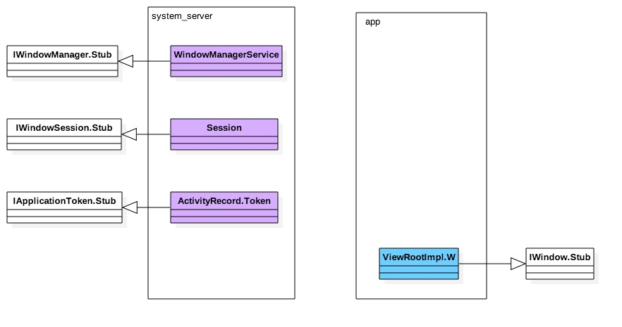

## 一. 概述

AMS是Android系统最为核心的服务之一，其职责包括四大核心组件与进程的管理，而四大组件中Activity最为复杂。
其复杂在于需要跟用户进行UI交互(涉及Window)，WMS其主要职责便是窗口管理，还有跟App,SurfaceFlinger等
模块间相互协同工作。简而言之：

- App主要是具体的UI业务需求
- AMS则是管理系统四大组件以及进程管理，尤其是Activity的各种栈以及状态切换等管理；
- WMS则是管理Activiy所相应的窗口系统(系统窗口以及嵌套的子窗口)；
- SurfaceFlinger则是将应用UI绘制到frameBuffer(帧缓冲区),最终由硬件完成渲染到屏幕上；

### 1.1 WMS全貌

说明: [点击查看大图](https://panard313.github.io/images/wms/wms_relation.jpg)

- WMS继承于`IWindowManager.Stub`, 作为Binder服务端;
- WMS的成员变量mSessions保存着所有的Session对象,Session继承于`IWindowSession.Stub`, 作为Binder服务端;
- 成员变量mPolicy: 实例对象为PhoneWindowManager,用于实现各种窗口相关的策略;
- 成员变量mChoreographer: 用于控制窗口动画,屏幕旋转等操作;
- 成员变量mDisplayContents: 记录一组DisplayContent对象,这个跟多屏输出相关;
- 成员变量mTokenMap: 保存所有的WindowToken对象; 以IBinder为key,可以是IAppWindowToken或者其他Binder的Bp端;
    - 另一端情况:ActivityRecord.Token extends IApplicationToken.Stub
- 成员变量mWindowMap: 保存所有的WindowState对象;以IBinder为key, 是IWindow的Bp端;
    - 另一端情况: ViewRootImpl.W extends IWindow.Stub
- 一般地,每一个窗口都对应一个WindowState对象, 该对象的成员变量mClient用于跟应用端交互,成员变量mToken用于跟AMS交互.

## 二. Activity与Window
 
### 2.1 Binder服务

上图是Window调用过程所涉及的Binder服务：

|Binder服务端|接口|所在进程|
|---|---|---|
|WindowManagerService|IWindowManager|system_server|
|Session|IWindowSession|system_server|
|ViewRootImpl.W|IWindow|app进程|
|ActivityRecord.Token|IApplicationToken|system_server|

Activity启动过程会执行组件的生命周期回调以及UI相关对象的创建。UI工作通过向AMS服务来
创建WindowState对象完成，该对象用于描述窗口各种状态属性，以及跟WMS通信。

1. WindowManagerService: Activity通过其成员变量mWindowManager(数据类型WindowManagerImpl)，再调用WindowManagerGlobal对象，经过binder call跟WMS通信；
2. Session：ViewRootImp创建的用于跟WMS中的Session进行通信；
3. ViewRootImpl.W：app端创建的binder服务；
4. ActivityRecord.Token: startActivity过程通过binder call进入system_server进程，在该进程执行ASS.startActivityLocked()方法中会创建相应的ActivityRecord对象，该对象初始化时会创建数据类型为ActivityRecord.Token的成员变量appToken，然后会将该对象传递到ActivityThread.

### 2.2 核心对象

#### 2.2.1 Activity对象
[-> Activity.java]

下面列举Activity对象的部分常见成员变量：

1. mWindow：数据类型为PhoneWindow，继承于Window对象；
2. mWindowManager：数据类型为WindowManagerImpl，实现WindowManager接口;
3. mMainThread：数据类型为ActivityThread, 并非真正的线程，只是运行在主线程的对象。
4. mUiThread: 数据类型为Thread，当前activity所在线程，即主线程;
5. mHandler：数据类型为Handler, 当前主线程的handler;
6. mDecor: 数据类型为View, Activity执行完resume之后创建的视图对象；

另外说明：WindowManagerImpl与Window这两个对象相互保存对方的信息：

- WindowManagerImpl.mParentWindowWindow 指向Window对象；
- Window.mWindowManager 指向WindowManagerImpl对象；

#### 2.2.2 ViewRootImpl对象

1. mWindowSession: 数据类型为IWindowSession, 同一进程中所有的ViewRootImpl对象只对应唯一相同的Session代理对象。
2. mWindow: 数据类型为IWindow.Stub，每个创建对应一个该对象。

#### 2.2.3 WindowState对象
WindowState对象代表一个窗口，记录在system_server.

- mSession: 数据类型为Session，是system_server的binder服务端；
- mClient: 数据类型为IWindow，是app端的ViewRootImpl.W服务的binder代理对象；

### 2.3 数量关系

1. 每一个Activity对应一个应用窗口；每一个窗口对应一个ViewRootImpl对象；
2. 每一个App进程对应唯一的WindowManagerGlobal对象；
  - WindowManagerGlobal.sWindowManagerService用于跟WMS交互
  - WindowManagerGlobal.sWindowSession用于跟Session交互；
3. 每一个App进程对应唯一的相同Session代理对象；
3. App可以没有Activity/PhoneWindow/DecorView，例如带悬浮窗口的Service；
4. Activity运行在ActivityThread所在的主线程；
3. DecorView是Activity所要显示的视图内容；
4. ViewRootImpl：管理DecorView跟WMS的交互；每次调用addView()添加窗口时，则都会创建一个ViewRootImpl对象；

### 2.4 AMS与WMS的对于关系
Activity与Window有一些对象具有一定的对应关系：

|AMS|WMS|
|---|---|
|ActivityRecord|AppWindowToken|
|TaskRecord|Task|
|ActivityStack|TaskStack|

### 2.5 交互

- App跟AMS通信，会建立Session连接到WMS，后续便通过IWindowSesson跟WMS通信；
- WMS跟SF通信，WMS建立SurfaceComposerClient，然后会在SF中创建Client与之对应，
后续便通过ISurfaceComposerClient跟SF通信；
  
### 2.6 IWindow死亡回调
[-> WindowState.java]

    private class DeathRecipient implements IBinder.DeathRecipient {
        public void binderDied() {
            try {
                synchronized(mService.mWindowMap) {
                    WindowState win = mService.windowForClientLocked(mSession, mClient, false);
                    Slog.i(TAG, "WIN DEATH: " + win);
                    if (win != null) {
                        mService.removeWindowLocked(win);
                    } else if (mHasSurface) {
                        Slog.e(TAG, "!!! LEAK !!! Window removed but surface still valid.");
                        mService.removeWindowLocked(WindowState.this);
                    }
                }
            } catch (IllegalArgumentException ex) {
                ...
            }
        }
    }

当App端进程死亡，运行在system_server的IWindow代理端会收到死亡回调，来处理移除相应的window信息。

## 三. 小结
还要重点聊一聊 主线程如何与UI交互。

未完待续...
