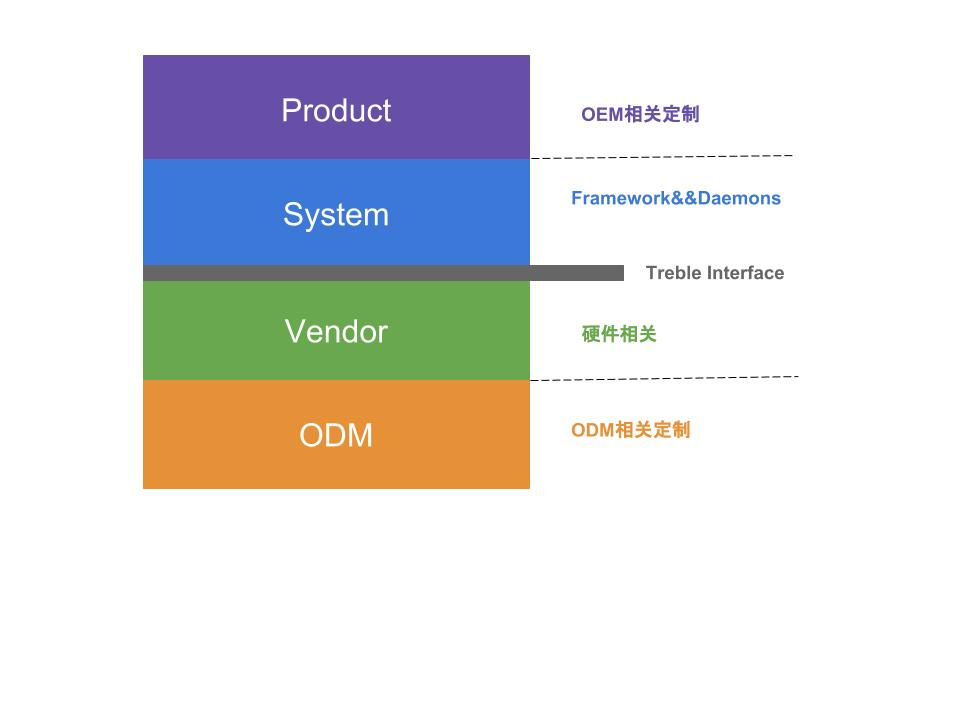
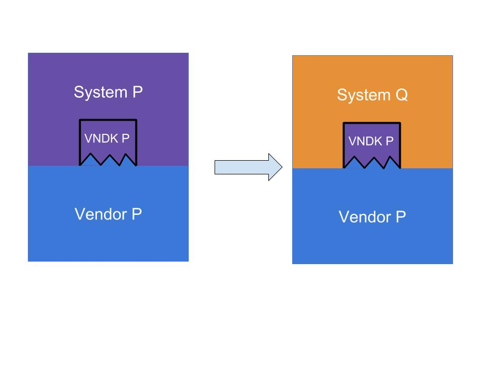
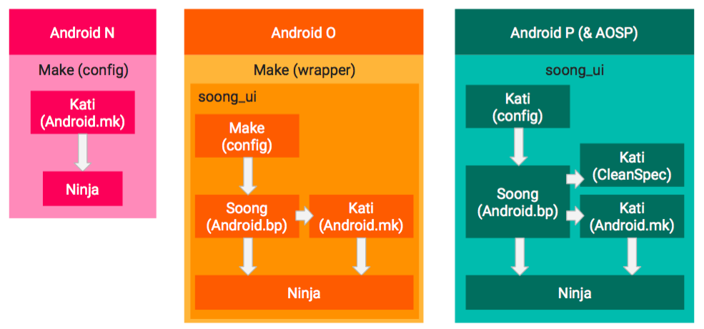

### 引言

2018年3月8日，谷歌发布了Android P的预览版，预计今年的Q3季度发布final release版本，有不少文章从开发者角度介绍了Android P的新特征，初步来看给感觉这次大版本似乎并没有什么改变。接下来，将从系统Treble，System，Framework，Runtime, Security等多方面来解读一下Android P的变化。

欢迎关注Gityuan的微信公众号：**Android达摩院(AndroidAcademy)**，后续会有更多精彩内容。

### Treble计划

Treble计划是一个非常重要的变革，对系统层面的影响很大。Google每发布一个Android大版本，到厂商和APP的适配，过程是漫长的，每一次大版本适配工作的艰难厂商最能体会，各种兼容性问题。正如去年发布的Android O，目前Android O机型用户量比较小，APP都没能快速跟进把targetSdk适配到O的情况下，Android P又即将到来，Android系统的碎片化一直是一个痛点。该计划的核心主旨是让系统与硬件相关的解耦，加快系统升级速度。Treble始于Android O，到Android P又得以进一步完善。

接下来，来看看Treble在整个Android系统的位置。

- Product: OEM相关定制，主要包括Apps，产品sysprops等
- System：Android系统的Framework和Daemons
- Treble Interface: Treble接口
- Vendor: 硬件相关
- ODM: ODM相关定制，比如VINTF支持

最中间Treble Interface组成成分，在Android O添加的接口：C++依赖(使用VNDK)，IPC调用(使用HIDL)，SELinux，通用Kernel接口，Android Verified Boot(AVB)；到Android P新增接口：Java依赖(使用System SDK)，系统Properties。从图中可以看出Treble计划是希望底层Vendor用旧版本，也能支持System层升级为新版本，从而保证Android大版本可快速升级。

这里需要注意，System Property兼容性对于treble来说是非常糟糕的，它允许平台和Vendor之间通过非稳定通道进行跨进程通信，这与treble的分离解耦背道而驰。
为此，treble计划通过分离properties到platform和vendor。platform进程只能访问平platform属性，vendor进程只能访问vendor属性, 当然也是允许platform属性去暴露给vendor进程。

1. 所有platform对外暴露的属性位于system/sepolicy/public/property_contexts，Vendor无法访问其他的平台属性；
2. 所有可用于vendor init脚本的属性位于system/core/init/stable_properties.h，Vendor init脚本不能使用其他的平台属性来作为
action triggers。
3. Vendor或者ODM属性必须有自己的命名空间，比如vendor., ro.vendor, persist.vendor等
4. vendor init使用vendor_init域名，保障只使用vendor相关权限，不可访问system-only的属性

VINTF(Vendor Interface)被分离成硬件无关(Framework)和硬件相关两部分。为了进一步规范化系统架构，定义了CKI(Common Kernel Interface)作为通用系统镜像必须依赖的内核接口集，并且对Kernel分支精简也进行了有效的精简。
VTS会测试HAL，Kernel, VNDK的可靠性，CTS测试通用系统接口，framework feature。从Android O以后就强制要求，通过CTS/VTS则会为system解耦合的适配提供了保障。

Treble语境中，Vendor是指片上系统的HAL层和外围设备，不依赖于硬件的软件则不属于Vendor；VNDK是指Vendor用于实现HAL层所提供的系统库。

- platform和Vendor的构建是相互隔离的。
- platform lib对应 system.img
- vendor lib对应 vendor.img
- 大多数情况下，Vendor lib跟系统核心不能相互使用；Vendor lib不允许dlopen私有的系统库
- 合作伙伴不允许为自己的产品在VNDK新增lib，只能贡献到AOSP

这一切都是为系统库与Vendor库之间的解耦合，在Android P上采用该方案，则下一个大版本Android Q更新，可以直接将新的System Q加上老Vendor P，组成新版本Android。

其中VNDK + Framework libs组成system.img, Vendor libs组成vendor.img。

Android P新添加命名空间namespace：

- System命名空间/system/lib/；
- Vendor命名空间有/system/lib/vndk，/system/lib/vndk-sp，/vendor/lib/vndk，/vendor/lib/vndk-sp

### System

#### 1. 存储性能提升

FDE用于Android 6.0, FBE用于Android 7.0，并且会创建DE和CE两个目录，提供更好的用户体验和隐私安全。 FDE很快会被彻底移除。
另外，未来会有更快的加密算法。

**文件系统**

文件系统配额从Android 8.0开始支持，三个主要目标是

- 当打开设置时能快速计算存储使用情况，提供更好的用户体验
- 更快和更公平的cache管理，通过quotas来管控滥用的app
- 通过配额方式来限制应用滥用存储空间

Fair cache策略：

  - 分配cache配额给每个App（基于他们使用的频率），删除最老的cached文件，直到有足够的空闲空间；
  - 最佳实践：定期调用新方法以保证系统有机会去删除缓存文件，可以follow PackageInstaller，DownloadManager和DocumentsUI。
限制滥用app: 
  - 设备应该卸载恶意app，或者删除大文件
  - 避免设备卡在循环的重启过程
  - 阻止app使用block90%, 或者inodes50%

- exFAT：Google没有资源支持相关的更新工作，只有会部分补丁；
- vold:跟fw通信方式，由socket调整为binder方式，用于提高性能；这是继installerd之后的再一次由socket转变成binder模块；
- TRIM: 该过程会运行f2fs GC操作，并且在夜间空闲时间来被调度执行；
- FUSE: 已被删除，采用sdcardfs, 后续会有esdfs用于更深远的优化
- 更快的文件拷贝： FileUtils.copy，比如纯userspace的方式快35~50%
- FDE,FUSE, ASECs这些都被删除。
  

#### 2. 简述Kernel

- framework想·的feature后续依赖Kernel 3.18或之后的版本，3.10将不再维护。另外Kernel 4.14已推到AOSP；
- ION: libion在Android P上已支持新的kernel ion接口，强烈建议 使用libion，而非直接使用ion ioctl调用
- kernel + clang: 强烈建议采用clang 5.0或之后版本，出错信息提供精准定位，占用内存和编译速度快，而gcc有一定的历史问题。
- sdcardfs: android O默认的文件系统，ro.sys.sdcardfs=1，Android O上默认的文件系统是sdcardfs，但允许关闭，回退到FUSE。而Android P则计划直接删除FUSE，很快会更新一版sdcardfs。对于文件系统，即便不使用sdcardfs，也强烈推荐使用基于内核的文件系统，而非用户空间。

#### 3. LMKD调整

基于内核的LMK缺点：

- 依赖于硬编码的剩余内存限制，而非基于内存紧张情况来调整；
- 厂商定制化比较多，也就意味着原有的设计比较死板，不适合增加policy定制，没有以group方式来杀进程
- 在slab shrinker API中插桩，Shrinkers本应该快速drop不再使用caches并退出，以避免拖慢内存扫描进程。
但事实上，lmk执行的工作量包括搜索目标进程以及杀掉它们，这个过程并非快速完成的动作
- 有可能出现把重要的进程杀掉，而非重要进程并没有被杀
- 从内核4.12中会移除lmk;

替代方案：用户态LMKD + memory cgroups

- 可打造更智能的基于内存压力的杀进程策略
- memory cgroups，内存压力事件，内存记账功能，额外的控制类似relaim和swappiness
- 能被更方便的记录日志和track
- 该方案的挑战：每个app需要有内存记账；杀进程组耗时；cgroups之间的task转移代价比较高；
- 相应解决方案：最新内核已降低内存开销，应用启动时间增加了3%，在多个小的LRU队列并不高效；
- 杀进程组耗时的问题，通过将杀进程过程移到AMS锁之外
- LMKD的杀进程组委托给ActivityManager

用户态LMKD策略：

- 通过ro.config.low_ram属性来划分低内存设备和高性能设备
  - 低内存设备：中等内存压力出现得比较常见，杀进程主要针对medium和critical内存压力情况，配置oom_adj_score，内存压力基于swap使用情况。杀进程策略会延迟，尽量保持服务处于运行中的状态
  - 高性能设备：优先考虑性能和尽可能留有更多内存来优化用户体验。杀的策略会提前，一次会杀多个进程以保证内存处于低压力状态，更加激进地释放内存以保持系统处于低内存压力的状态

未来

  - 提高杀进程策略，基于输入信号（可用内存，task大小，内存压力值，内存压力事件的频繁成都）
  - 合并杀进程策略，提供更多controll机制
  - 探索杀的时机，以及内存压力的潜力
  - 配合cgroups v2
    
#### 4. F2FS
sdcardfs和fuse才是一个层面的东西，sdcardfs比fuse的的性能更好，对同一文件的操作，fuse需要经历6次用户态与内核态的切换，而sdcardfs只需要两次。对于fuse可以使用各种文件系统，比如ext3, ext4, f2fs.

(F2FS,Flash-Friendly File System)文件系统重要特性

- 后台清理：当文件系统碎片化比较严重的时候，读写速度会有所下降，开启一个反碎片的后台线程来清理文件碎片；
- 异步discard：Discard文件系统的淘汰存储空间，对于减少闪存过度GC是很有必要的，当同步的discard对用户来说会有比较大的延迟，故采用异步Discard；
- 原子写：SQLite是Android默认的数据库，通过管理记录文件来保障数据安全，这会带来大量冗余的写和同步操作；原子写能有效减少记录文件；

F2FS相比ext4在文件顺序写、随机写以及SQLite方面有较大幅度的提升。Google将持续调整F2FS的性能与稳定性方面的表现。

#### 5. 性能
在Android O上将Binder大锁拆分为更细粒度的锁，便真正解决了binder锁竞争问题。

- 内核驱动代码在必要时可采用RT调度器，避免在驱动里有长时间地禁用抢占
- 建议：
  - 如果可能，建议使用mem cgroups 
  - userdata文件系统，建议采用f2fs
  - 关闭不需要的内核配置项
  - 移除不必要的日志
  - 在早期的文档中建议低内存设备要开启KSM，之后的版本不要使用KSM

P上更加注重相同性能下如何改进功耗，EAS作为通用的基于功耗模型和性能数据的CPU调度算法，而非tuning的方式。
为什么Android采用EAS调度算法呢？需要一个标准的结合功耗和性能的调度器，能通过Framework来调整调度策略，这里需要考虑资源负载均衡、大小核、cpufreq、 governor、减少大核的使用、平衡功耗问题，2018.5完成EAS r1.6版本。

### Framework

#### 1. AMS

从Android P开始，只有当Intent flag中指定了FLAG_ACTIVITY_NEW_TASK，才允许在非Activity场景启动Activity。
APP必须拥有FOREGROUND_SERVICE权限，才允许使用前台服务，否则会抛出异常。

目前很多APP开发者们对Android O的一些后台限制行为不太了解这些变更，遇到问题可能误以为系统问题，所以这里说到这顺便提一下关于Android O对后台行为的一些管控。

- 后台服务(Background Service)限制
  - 当进程处于后台1分钟后会进入idle状态，系统停止其后台服务，也就意味着应用处于后台必须1分钟内处理完收尾工作，不允许在后台长时间监控系统，从而节省功耗；对于应用后台执行用户不可感知的操作，官方推荐使用JobScheduler
  - 后台进程不允许通过startService方式启动服务，否则当targetSdk>=26的情况下会抛出IllegalStateException；
  - 对前台服务(Foreground Service)不会有这个限制，因为前台服务都会挂一个前台通知对用户来说是可见的。Android O新增startForegroundService()，用于启动前台服务，但有一个限制条件就是应用必须服务启动后5秒之内调用startForeground()，否则会抛出ANR
  
- 广播(Broadcast)限制: 
  - 应用无法使用其清单注册的大部分隐式广播，但部分隐式广播是被允许的, 比如BOOT_COMPLETED, LOCALE_CHANGED等。这样做是为了省电和性能，防止大量APP通过监听各种广播来拉起自己。
  - 清单注册的显式广播和动态注册的隐式广播依然可以正常工作。

#### 2. PMS
重构Package Manger，减少核心服务的代码复杂度，将permission,intent等代码移到单独的类，
将user management,dex,shortcuts等不相关代码移到子包；尽可能操作本地数据，避免加锁；同时增加单元测试。

PMS在Android O主要改动是优化启动时间，将操作尽可能并行化执行，在Android P上主要改动是扫描过程scanPackageOnly()，
下一步提取更多的子组件和类，比如Intent resolution, package verification, dexopt等，减少修改对象成员的方法。

#### 3. WMS
在Android O上，结构化窗口对象模型和容器层次结构, 提高CTS覆盖率并引入单元测试，SurfaceFlinger中引入层级结构用于SurfaceView，引入Task快照。在Android P上，继续提升创建对象模型，同步APP Transitions，WindowScope工具，

过度使用Stack ID, Stack管理着类似的task和activity，特定的窗口模式，例如HOME_STACK_ID，FULLSCREEN_STACK_ID，FREEFORM_STACK_ID，这就导致同一个Stack的task和activity不允许有不同的窗口模式。新的方案允许有多个WindowContainers，窗口模式不再受限于Stack ID。

采用同步的APP Transitions, animations的过程可不再需要WMS大锁。另外Transitions，WindowScope工具是一个类似于systrace的工具，可用于方便查看WindowManager和SurfaceFlinger，仅在userdebug版本开启，对性能影响较小。

#### 4. 续航提升
之前关于续航方面，有JobScheduler, Doze, 限制隐式广播，后台服务和定位限制，缓存wakelock释放等功能，
一直以来Google在功耗方面没有从整体上的策略，不同OEM往往会有不同的策略针对功耗，比如Force stop app，
kill activity/service等。这次Android P在功耗方面也是重点，Google计划在Android P上采用机器学习的思路来预测用户使用习惯，来做省电优化。
从而把APP分为四类Active, working_set,frequent, rare，划分到不同bucket的app则采取对Jobs，Alarms,Network, FCM等限制策略。

目前很多应用为了后台存活，都挂fg-service，其实Google，包括厂商都非常不建议开发者一直这样使用的，应该尽量克制，只要需要的场景使用，比如后台导航、后台播放音乐。
这也是为什么fg-service一定要显示通知，为的是让用户可知应用的行为，对于不该后台活动的依然挂前台通知，那么用户可能会主动杀它，甚至卸载。

#### 5. 机器学习
在Android 8.1中引入神经网络API，提供Android内置的机器学习，在Android P中又进一步扩展和改进TensorFlow.
在Android P上采用AI预测用户行为来进行更智能化的省电策略，在UI搜索界面也使用到机器学习，AI正在逐步强化Android系统

Dynamic App,需应用商店支持，资源文件，配置，语言，App内部基于版本格式的信息等都可以采用Dynamic App来精简APK尺寸。
Autofill：平台、插件、app、浏览器，一套完整的自动填充框架解决方案

#### 6. Location

**电话体验**
提升打电话的用户体验，扩展APIs从而支持不同APP的电话并发，Telecom可跟踪所有的活动来电，但只有一个应用可获取焦点。另外，
调整SIM状态改变的广播，SIM_STATE_CHANGED改为SIM_CARD_STATE_CHANGED和SIM_APPLICATION_STATE_CHANGED广播。
也同步调整了TelephonyManager。

**活动检测**
活动检测会结合传感器和声音数据，能识别走路、跑步、骑车、开车、上下楼梯，甚至要区分使用者是在汽车、地铁、火车，还是摩托车，也能识别睡眠模式，
当AR检测到处于开车模式，则停止通知以避免打扰开车人员。为系统提供使用者活动状态转换的API

**室内导航**
一直以来无法做到精准的WIFI室内定位，次次Android P系统支持了IEEE 802.11mc WiFi协议，室内导航功能即将到来，应用能使用室内定位，为定位服务提供便利。

**CHRE**
优化功耗就意味着需要尽可能少的唤醒AP，比如Doze模式，后台定位限制模式。定义一个Context Hub运行时环境，在该环境下的CPU不允许直接运行Java/Linux，只允许执行特殊的功能。
在Android P实现了Context Hub Service，使用起来更加简单。后续可以有always-on,低功耗模式

### Runtime 

#### 1. ART和libcore
在安装、更新、OTA的时候ART需从APK里提取压缩过的dex并进行校验，这样既浪费空间，也浪费CPU时间。
为此，正在做的方案是采用未压缩的dex文件，商店将会对其进行Java校验并将校验结果直接在安装过程使用。
对于dex文件开始采用一个新的紧凑的格式，减少对内存和存储空间的使用，更加智能的布局优化，更少的闪存读取。

关于调试方面，使用JVMTI来替代ART debugger，提供更多的扩展功能，包括断点、异常等事件，本地变量审查，字段监测，类的重定义。

Backtraces使用Java上下文来显示，省去使用addr2line来转换的一个过程，方便调试分析问题。例如

Kotlin作为Android官方正式语言，其性能并不会比Java执行慢

**Profiles in the Cloud：**
从N开始使用profile方式编译，对于存储空间、内存、功耗、CPUs使用率都有益处，但目前profile只是本地的方式，
在优先之前仍需要等待获取profile。未来收集用户的profile,并上传到云端(Google play)，在安装时从云端获取profile直接使用到新用户。
大概能提升20%的冷启动性能。

**core lib**
升级libcore代码到OpenJDK 9。APP弃用策略，Android将添加支持的最低版本，当targetVersionSdk<17的app则会弹出警告框。
从bootclasspath中移除Apache HTTP库、JUnit

#### 2. Soong编译系统
采用Soong来编译Java，从GNU Make移植到Soong

跨版本构建过程:

Android P到底可见的Android.bp，所有依赖必须使用android.bp，androidmk工具可用于将make文件转换为Android.bp文件；

#### 3. 私有API

Android P在运行时强制限制应用通过反射方式来操作被标记为@hide的类、方法、属性。
将API分为4类：白名单、灰名单、深灰名单、黑名单；当API属于白名单则不限制，灰名单(targetSdk ≥P)则警告，黑名单则
抛出NoSuchFieldException/NoSuchMethodException异常。对于深灰名单，介于灰名单和黑名单之间，取决targetSdk，
当(targetSdk ≥P)按黑名单方式处理，当(targetSdk ＜P)按灰名单方式处理。
对于黑名单只允许平台APP使用，对于灰白名单的API虽然不会直接抛出异常，但不再保证跨版本的兼容性，这样限制是为了后续新版本能更快地完成适配。

Google之所以要设计灰白黑名单，也是为了给应用一个过渡时机，也给Android一个完善公开API的机会，对于某些很重要的@hide接口，可能也会考虑适当增加公开接口，另外那些API会被第一批加入黑名单，还需拭目以待。对于AOSP的黑名单和深灰名单将放入CTS测试，进而限制厂商不能轻易修改名单。

关于兼容性测试，Google目前有CTS/VTS/GTS，其中CTS主要测试API行为，VTS针对Treble计划以及测试HW实现，GTS针对GMS需求和分销协议，
很快Google还会推出STS，用于隐私测试。从Top应用的测试数据来看，目前国内大多数的APP都存在兼容性问题，问题主要集中在热修复、混淆、加固以及依赖internal API。

另外，@SystemApi不再向后兼容，另外几乎所有的系统API都需要权限。
/vendor/priv-app将在Android P上支持，权限会被限制有vendorPrivileged标识的权限。

### Security

将所有网络流量从明文转向TLS，更改网络安全性配置 (Network Security Configuration) 的默认值，以阻止所有明文流量。
为保护用户隐私，当应用UID空闲时，断开应用对摄像头、话筒、传感器的使用，如果应用强制使用则会产生错误，从而进一步防止流氓应用后台手机隐私数据。

FBE加密：FBE将会更容易支持高端元数据加密的设备，以及对sdcard的支持。对于OEMs能够更简单地移植。对于低端设备，更快速的算法，适合所有机型的移植

### 总结

- Android P的Treble计划为后续Android大版本可快速升级提供支撑；
- 采用全新的Soong编译系统，将Android.mk全面替换为Android.bp；
- 私有API的限制进一步规范化Android生态，但同时也面临着生态圈中大多数的APP都不可用的风险挑战；
- 默认采用sdcardfs提升存储性能，F2FS相比ext4在文件顺序写、随机写以及SQLite方面有较大幅度的提升；
- Framework逐步优化PMS、WMS大锁，未来应该还优化AMS锁；
- 逐步试水AI技术，增强对APP后台管控，以提升系统续航能力。

总之，Google一方面从系统层面不断优化Android系统；另一方面致力于改善APP生态，不断加强对非友善APP的管控，减少其对系统性能与续航的影响。
