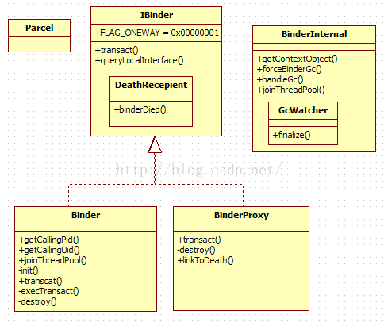
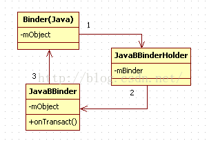
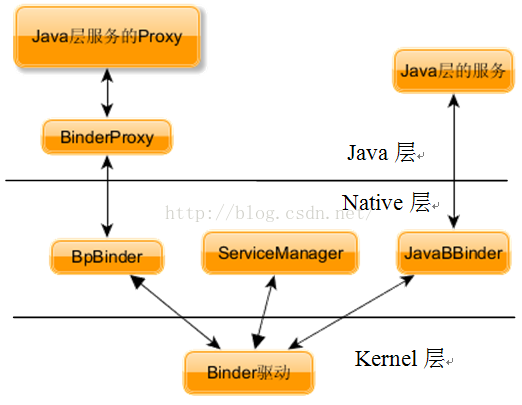
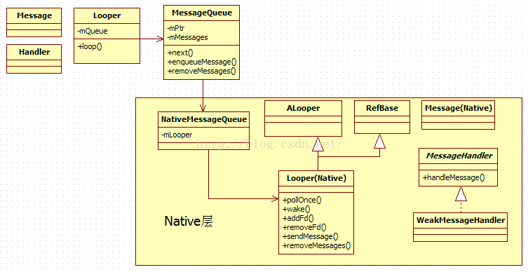

# 第2章  深入理解Java Binder和MessageQueue

**本章主要内容：**

-  介绍Binder系统的Java层框架

-  介绍MessageQueue

**本章所涉及的源代码文件名及位置：**

-  IBinder.java

frameworks/base/core/java/android/os/IBinder.java

-  Binder.java

frameworks/base/core/java/android/os/Binder.java

-  BinderInternal.java

frameworks/base/core/java/com/android/intenal/os/BinderInternal.java

-  android_util_Binder.cpp

frameworks/base/core/jni/android_util_Binder.cpp

-  SystemServer.java

frameworks/base/services/java/com/android/servers/SystemServer.java

-  ActivityManagerService.java

frameworks/base/services/java/com/android/servers/ActivityManagerService.java

-  ServiceManager.java

frameworks/base/core/java/android/os/ServiceManager.java

-  ServcieManagerNative.java

frameworks/base/core/java/android/os/ ServcieManagerNative.java

-  MessageQueue.java

frameworks/base/core/java/android/os/MessageQueue.java

-  android_os_MessageQueue.cpp

frameworks/base/core/jni/android_os_MessageQueue.cpp

-  Looper.cpp

frameworks/base/native/android/Looper.cpp

-  Looper.h

frameworks/base/include/utils/Looper.h

-  android_app_NativeActivity.cpp

frameworks/base/core/jni/android_app_NativeActivity.cpp

## 2.1  概述
以本章做为本书Android分析之旅的开篇，将重点关注两个基础知识点，它们是：

-  Binder系统在Java世界是如何布局和工作的
-  MessageQueue的新职责

先来分析Java层中的Binder。

建议读者先阅读《深入理解Android：卷I》（以下简称“卷I”）的第6章“深入理解Binder”。网上有样章可下载。

## 2.2  Java层中的Binder分析
### 2.2.1  Binder架构总览

如果读者读过卷I第6章“深入理解Binder”，相信就不会对Binder架构中代表Client的Bp端及代表Server的Bn端感到陌生。Java层中Binder实际上也是一个C/S架构，而且其在类的命名上尽量保持与Native层一致，因此可认为，Java层的Binder架构是Native层Binder架构的一个镜像。Java层的Binder架构中的成员如图2-1所示。



由图2-1可知：

-  系统定义了一个IBinder接口类以及DeathRecepient接口。

-  Binder类和BinderProxy类分别实现了IBinder接口。其中Binder类作为服务端的Bn的代表，而BinderProxy作为客户端的Bp的代表。

-  系统中还定义一个BinderInternal类。该类是一个仅供Binder框架使用的类。它内部有一个GcWatcher类，该类专门用于处理和Binder相关的垃圾回收。

-  Java层同样提供一个用于承载通信数据的Parcel类。

注意，IBinder接口类中定义了一个叫FLAG_ONEWAY的整型，该变量的意义非常重要。当客户端利用Binder机制发起一个跨进程的函数调用时，调用方（即客户端）一般会阻塞，直到服务端返回结果。这种方式和普通的函数调用是一样的。但是在调用Binder函数时，在指明了FLAG_ONEWAY标志后，调用方只要把请求发送到Binder驱动即可返回，而不用等待服务端的结果，这就是一种所谓的非阻塞方式。在Native层中，涉及的Binder调用基本都是阻塞的，但是在Java层的framework中，使用FLAG_ONEWAY进行Binder调用的情况非常多，以后经常会碰到。

**思考** 使用FLAG_ONEWAY进行函数调用的程序在设计上有什么特点？这里简单分析一下：对于使用FLAG_ONEWAY的函数来说，客户端仅向服务端发出了请求，但是并不能确定服务端是否处理了该请求。所以，客户端一般会向服务端注册一个回调（同样是跨进程的Binder调用），一旦服务端处理了该请求，就会调用此回调来通知客户端处理结果。当然，这种回调函数也大多采用FLAG_ONEWAY的方式。

### 2.2.2  初始化Java层Binder框架
虽然Java层Binder系统是Native层Binder系统的一个Mirror，但这个Mirror终归还需借助Native层Binder系统来开展工作，即Mirror和Native层Binder有着千丝万缕的关系，一定要在Java层Binder正式工作之前建立这种关系。下面分析Java层Binder框架是如何初始化的。

在Android系统中，在Java初创时期，系统会提前注册一些JNI函数，其中有一个函数专门负责搭建Java Binder和Native Binder交互关系，该函数是register_android_os_Binder，代码如下：

[-->android_util_Binder.cpp]

```java
int register_android_os_Binder(JNIEnv* env)
{
    //初始化Java Binder类和Native层的关系
    if(int_register_android_os_Binder(env) < 0)
        return -1;
    //初始化Java BinderInternal类和Native层的关系
    if(int_register_android_os_BinderInternal(env) < 0)
        return -1;
    //初始化Java BinderProxy类和Native层的关系
    if(int_register_android_os_BinderProxy(env) < 0)
        return -1;
    //初始化Java Parcel类和Native层的关系
    if(int_register_android_os_Parcel(env) < 0)
        return -1;
    return0;
}
```
据上面的代码可知，register_android_os_Binder函数完成了Java Binder架构中最重要的4个类的初始化工作。我们重点关注前3个。
#### 1.  Binder类的初始化

int_register_android_os_Binder函数完成了Binder类的初始化工作，代码如下：

[-->android_util_Binder.cpp]
```java
static int int_register_android_os_Binder(JNIEnv*env)
{
    jclassclazz;

    //kBinderPathName为Java层中Binder类的全路径名，“android/os/Binder“
    clazz =env->FindClass(kBinderPathName);
    /*
       gBinderOffSets是一个静态类对象，它专门保存Binder类的一些在JNI层中使用的信息，
       如成员函数execTranscat的methodID,Binder类中成员mObject的fildID
     */
    gBinderOffsets.mClass = (jclass) env->NewGlobalRef(clazz);
    gBinderOffsets.mExecTransact
        = env->GetMethodID(clazz,"execTransact", "(IIII)Z");
    gBinderOffsets.mObject
        = env->GetFieldID(clazz,"mObject", "I");
    //注册Binder类中native函数的实现
    returnAndroidRuntime::registerNativeMethods(
            env, kBinderPathName,
            gBinderMethods,NELEM(gBinderMethods));
}
```

从上面代码可知，gBinderOffsets对象保存了和Binder类相关的某些在JNI层中使用的信息。

建议 如果读者对JNI不是很清楚，可参阅卷I第2章“深入理解JNI”。

#### 2.  BinderInternal类的初始化

下一个初始化的类是BinderInternal，其代码在int_register_android_os_BinderInternal函数中。

[-->android_util_Binder.cpp]
```java
static intint_register_android_os_BinderInternal(JNIEnv* env)
{
    jclass clazz;
    //根据BinderInternal的全路径名找到代表该类的jclass对象。全路径名为
    // “com/android/internal/os/BinderInternal”
    clazz =env->FindClass(kBinderInternalPathName);
    //gBinderInternalOffsets也是一个静态对象，用来保存BinderInternal类的一些信息
    gBinderInternalOffsets.mClass = (jclass)env->NewGlobalRef(clazz);
    //获取forceBinderGc的methodID
    gBinderInternalOffsets.mForceGc
        = env->GetStaticMethodID(clazz,"forceBinderGc", "()V");
    //注册BinderInternal类中native函数的实现
    return AndroidRuntime::registerNativeMethods(
            env,kBinderInternalPathName,
            gBinderInternalMethods, NELEM(gBinderInternalMethods));
}
```

`int_register_android_os_BinderInternal`的工作内容和int_register_android_os_Binder的工作内容类似：

-  获取一些有用的methodID和fieldID。这表明JNI层一定会向上调用Java层的函数。
-  注册相关类中native函数的实现。

#### 3.  BinderProxy类的初始化

`int_register_android_os_BinderProxy`完成了BinderProxy类的初始化工作，代码稍显复杂，如下所示：

[-->android_util_Binder.cpp]
```java
static intint_register_android_os_BinderProxy(JNIEnv* env)
{
    jclassclazz;

    clazz =env->FindClass("java/lang/ref/WeakReference");
    //gWeakReferenceOffsets用来和WeakReference类打交道
    gWeakReferenceOffsets.mClass = (jclass)env->NewGlobalRef(clazz);
    //获取WeakReference类get函数的MethodID
    gWeakReferenceOffsets.mGet= env->GetMethodID(clazz, "get",
            "()Ljava/lang/Object;");
    clazz = env->FindClass("java/lang/Error");
    //gErrorOffsets用来和Error类打交道
    gErrorOffsets.mClass = (jclass) env->NewGlobalRef(clazz);

    clazz =env->FindClass(kBinderProxyPathName);
    //gBinderProxyOffsets用来和BinderProxy类打交道
    gBinderProxyOffsets.mClass = (jclass) env->NewGlobalRef(clazz);
    gBinderProxyOffsets.mConstructor= env->GetMethodID(clazz,"<init>", "()V");
    ...... //获取BinderProxy的一些信息
        clazz =env->FindClass("java/lang/Class");
    //gClassOffsets用来和Class类打交道
    gClassOffsets.mGetName=env->GetMethodID(clazz,
            "getName","()Ljava/lang/String;");
    //注册BinderProxy native函数的实现
    returnAndroidRuntime::registerNativeMethods(env,
            kBinderProxyPathName,gBinderProxyMethods,
            NELEM(gBinderProxyMethods));
}
```

据上面代码可知，int_register_android_os_BinderProxy函数除了初始化BinderProxy类外，还获取了WeakReference类和Error类的一些信息。看来BinderProxy对象的生命周期会委托WeakReference来管理，难怪JNI层会获取该类get函数的MethodID。

至此，Java Binder几个重要成员的初始化已完成，同时在代码中定义了几个全局静态对象，分别是gBinderOffsets、gBinderInternalOffsets和gBinderProxyOffsets。

这几个对象的命名中都有一个Offsets，我觉得这非常别扭，不知道读者是否有同感。

框架的初始化其实就是提前获取一些JNI层的使用信息，如类成员函数的MethodID，类成员变量的fieldID等。这项工作是必需的，因为它能节省每次使用时获取这些信息的时间。当Binder调用频繁时，这些时间累积起来还是不容小觑的。

下面我们通过一个例子来分析Java Binder的工作流程。

### 2.2.3  窥一斑，可见全豹乎

这个例子源自ActivityManagerService，我们试图通过它揭示Java层Binder的工作原理。先来描述一下该例子的分析步骤：

-  首先分析AMS如何将自己注册到ServiceManager。
-  然后分析AMS如何响应客户端的Binder调用请求。

本例的起点是setSystemProcess，其代码如下所示：

[-->ActivityManagerService.java]
```java
public static void setSystemProcess() {
    try {
        ActivityManagerService m = mSelf;
        //将ActivityManagerService服务注册到ServiceManager中
        ServiceManager.addService("activity", m);......
    }
    ......
        return;
}
```

上面所示代码行的目的是将ActivityManagerService服务加到ServiceManager中。ActivityManagerService（以后简称AMS）是Android核心服务中的核心，我们以后会经常和它打交道。

大家知道，整个Android系统中有一个Native的ServiceManager（以后简称SM）进程，它统筹管理Android系统上的所有Service。成为一个Service的首要条件是先在SM中注册。下面来看Java层的Service是如何向SM注册的。

#### 1.  向ServiceManager注册服务

- （1） 创建ServiceManagerProxy

向SM注册服务的函数叫addService，其代码如下：

[-->ServiceManager.java]
```java
public static void addService(String name, IBinderservice) {
    try {
        //getIServiceManager返回什么
        getIServiceManager().addService(name,service);
    }
    ......
}

//分析getIServiceManager函数
private static IServiceManagergetIServiceManager() {
    ......
        //调用asInterface，传递的参数类型为IBinder       
        sServiceManager= ServiceManagerNative.asInterface(
                BinderInternal.getContextObject());
    returnsServiceManager;
}
```

`asInterface`的参数为`BinderInternal.getContextObject`的返回值。这是一个native的函数，其实现的代码为：

[-->android_util_Binder.cpp]
```java
static jobjectandroid_os_BinderInternal_getContextObject(
        JNIEnv* env, jobject clazz)
{
    /*
       下面这句代码，我们在卷I第6章详细分析过，它将返回一个BpProxy对象，其中
       NULL（即0，用于标识目的端）指定Proxy通信的目的端是ServiceManager
     */
    sp<IBinder>b = ProcessState::self()->getContextObject(NULL);
    //由Native对象创建一个Java对象,下面分析该函数
    returnjavaObjectForIBinder(env, b);
}
```

[-->android_util_Binder.cpp]
```java
jobject javaObjectForIBinder(JNIEnv* env, constsp<IBinder>& val)
{
    //mProxyLock是一个全局的静态CMutex对象
    AutoMutex_l(mProxyLock);

    /*
       val对象实际类型是BpBinder，读者可自行分析BpBinder.cpp中的findObject函数。
       事实上，在Native层的BpBinder中有一个ObjectManager，它用来管理在Native BpBinder
       上创建的Java BpBinder对象。下面这个findObject用来判断gBinderProxyOffsets
       是否已经保存在ObjectManager中。如果是，那就需要删除这个旧的object
     */
    jobject object =(jobject)val->findObject(&gBinderProxyOffsets);
    if(object != NULL) {
        jobject res = env->CallObjectMethod(object, gWeakReferenceOffsets.mGet);
        android_atomic_dec(&gNumProxyRefs);
        val->detachObject(&gBinderProxyOffsets);
        env->DeleteGlobalRef(object);
    }

    //创建一个新的BinderProxy对象，并注册到Native BpBinder对象的ObjectManager中
    object= env->NewObject(gBinderProxyOffsets.mClass,
            gBinderProxyOffsets.mConstructor);
    if(object != NULL) {
        env->SetIntField(object, gBinderProxyOffsets.mObject,(int)val.get());
        val->incStrong(object);
        jobject refObject = env->NewGlobalRef(
                env->GetObjectField(object, gBinderProxyOffsets.mSelf));
        /*
           将这个新创建的BinderProxy对象注册（attach）到BpBinder的ObjectManager中，
           同时注册一个回收函数proxy_cleanup。当BinderProxy对象撤销（detach）的时候，
           该函数会 被调用，以释放一些资源。读者可自行研究proxy_cleanup函数。
         */
        val->attachObject(&gBinderProxyOffsets, refObject,
                jnienv_to_javavm(env),proxy_cleanup);

        //DeathRecipientList保存了一个用于死亡通知的list
        sp<DeathRecipientList>drl = new DeathRecipientList;
        drl->incStrong((void*)javaObjectForIBinder);
        //将死亡通知list和BinderProxy对象联系起来
        env->SetIntField(object, gBinderProxyOffsets.mOrgue,
                reinterpret_cast<jint>(drl.get()));
        //增加该Proxy对象的引用计数
        android_atomic_inc(&gNumProxyRefs);
        //下面这个函数用于垃圾回收。创建的Proxy对象一旦超过200个，该函数
        //将调用BinderInter类的ForceGc做一次垃圾回收
        incRefsCreated(env);
    }

    returnobject;
}
```

`BinderInternal.getContextObject`的代码有点多，简单整理一下，可知该函数完成了以下两个工作：

-  创建了一个Java层的BinderProxy对象。
-  通过JNI，该BinderProxy对象和一个Native的BpProxy对象挂钩，而该BpProxy对象的通信目标就是ServiceManager。

大家还记得在Native层Binder中那个著名的interface_cast宏吗？在Java层中，虽然没有这样的宏，但是定义了一个类似的函数asInterface。下面来分析ServiceManagerNative类的asInterface函数，其代码如下：

[-->ServiceManagerNative.java]
```java
static public IServiceManager asInterface(IBinderobj)
{
    ...... //以obj为参数，创建一个ServiceManagerProxy对象
        return new ServiceManagerProxy(obj);
}
 ```

上面代码和Native层interface_cast非常类似，都是以一个BpProxy对象为参数构造一个和业务相关的Proxy对象，例如这里的ServiceManagerProxy对象。ServiceManagerProxy对象的各个业务函数会将相应请求打包后交给BpProxy对象，最终由BpProxy对象发送给Binder驱动以完成一次通信。

提示 实际上BpProxy也不会和Binder驱动交互，真正和Binder驱动交互的是IPCThreadState。


- （2） addService函数分析

现在来分析ServiceManagerProxy的addService函数，其代码如下：

[-->ServcieManagerNative.java]
```java
public void addService(String name, IBinderservice)
    throws RemoteException {
        Parcel data = Parcel.obtain();
        Parcel reply = Parcel.obtain();
        data.writeInterfaceToken(IServiceManager.descriptor);
        data.writeString(name);
        //注意下面这个writeStrongBinder函数，后面我们会详细分析它
        data.writeStrongBinder(service);
        //mRemote实际上就是BinderProxy对象，调用它的transact，将封装好的请求数据
        //发送出去
        mRemote.transact(ADD_SERVICE_TRANSACTION, data, reply, 0);
        reply.recycle();
        data.recycle();
    }
```

BinderProxy的transact，是一个native函数，其实现函数的代码如下所示：

[-->android_util_Binder.cpp]
```java
static jbooleanandroid_os_BinderProxy_transact(JNIEnv* env, jobject obj,
        jintcode, jobject dataObj,
        jobject replyObj, jint flags)
{
    ......
        //从Java的Parcel对象中得到Native的Parcel对象
        Parcel*data = parcelForJavaObject(env, dataObj);
    if (data== NULL) {
        return JNI_FALSE;
    }
    //得到一个用于接收回复的Parcel对象
    Parcel*reply = parcelForJavaObject(env, replyObj);
    if(reply == NULL && replyObj != NULL) {
        return JNI_FALSE;
    }
    //从Java的BinderProxy对象中得到之前已经创建好的那个Native的BpBinder对象
    IBinder*target = (IBinder*)
        env->GetIntField(obj, gBinderProxyOffsets.mObject);
    ......
        //通过Native的BpBinder对象，将请求发送给ServiceManager
        status_terr = target->transact(code, *data, reply, flags);
    ......
        signalExceptionForError(env, obj, err);
    returnJNI_FALSE;
}
```

看了上面的代码会发现，Java层的Binder最终还是要借助Native的Binder进行通信的。

关于Binder这套架构，笔者有一个体会愿和读者一起讨论分析。

从架构的角度看，在Java中搭建了一整套框架，如IBinder接口，Binder类和BinderProxy类。但是从通信角度看，不论架构的编写采用的是Native语言还是Java语言，只要把请求传递到Binder驱动就可以了，所以通信的目的是向binder发送请求和接收回复。在这个目的之上，考虑到软件的灵活性和可扩展性，于是编写了一个架构。反过来说，也可以不使用架构（即没有使用任何接口、派生之类的东西）而直接和binder交互，例如ServiceManager作为Binder的一个核心程序，就是直接读取/dev/binder设备，获取并处理请求。从这一点上看，Binder的目的虽是简单的（即打开binder设备，然后读请求和写回复），但是架构是复杂的（编写各种接口类和封装类等）。我们在研究源码时，一定要先搞清楚目的。实现只不过是达到该目的的一种手段和方式。脱离目的的实现，如缘木求鱼，很容易偏离事物本质。

在对addService进行分析时，我们曾提示writeStrongBinder是一个特别的函数。那么它特别在哪里呢？

- （3） 三人行之Binder、JavaBBinderHolder和JavaBBinder

ActivityManagerService从ActivityManagerNative类派生，并实现了一些接口，其中和Binder的相关的只有这个ActivityManagerNative类，其原型如下：

[-->ActivityManagerNative.java]
```java
public abstract class ActivityManagerNative
extends Binder
implementsIActivityManager
```

ActivityManagerNative从Binder派生，并实现了IActivityManager接口。下面来看ActivityManagerNative的构造函数：

[-->ActivityManagerNative.java]
```java
public ActivityManagerNative() {
    attachInterface(this, descriptor);//该函数很简单，读者可自行分析
}
//这是ActivityManagerNative父类的构造函数，即Binder的构造函数
public Binder() {
    init();
}
```

Binder构造函数中会调用native的init函数，其实现的代码如下：

[-->android_util_Binder.cpp]
```java
static void android_os_Binder_init(JNIEnv* env,jobject obj)
{
    //创建一个JavaBBinderHolder对象
    JavaBBinderHolder* jbh = new JavaBBinderHolder();
    bh->incStrong((void*)android_os_Binder_init);
    //将这个JavaBBinderHolder对象保存到Java Binder对象的mObject成员中
    env->SetIntField(obj, gBinderOffsets.mObject, (int)jbh);
}
```

从上面代码可知，Java的Binder对象将和一个Native的JavaBBinderHolder对象相关联。那么，JavaBBinderHolder是何方神圣呢？其定义如下：

[-->android_util_Binder.cpp]
```java
class JavaBBinderHolder : public RefBase
{
    public:
        sp<JavaBBinder> get(JNIEnv* env, jobject obj)
        {
            AutoMutex _l(mLock);
            sp<JavaBBinder> b = mBinder.promote();
            if(b == NULL) {
                //创建一个JavaBBinder，obj实际上是Java层中的Binder对象
                b = new JavaBBinder(env, obj);
                mBinder = b;
            }
            return b;
        }
        ......
    private:
            Mutex           mLock;
            wp<JavaBBinder> mBinder;
};
```

从派生关系上可以发现，JavaBBinderHolder仅从RefBase派生，所以它不属于Binder家族。Java层的Binder对象为什么会和Native层的一个与Binder家族无关的对象绑定呢？仔细观察JavaBBinderHolder的定义可知：JavaBBinderHolder类的get函数中创建了一个JavaBBinder对象，这个对象就是从BnBinder派生的。

那么，这个get函数是在哪里调用的？答案在下面这句代码中：

    //其中，data是Parcel对象，service此时还是ActivityManagerService
    data.writeStrongBinder(service);

writeStrongBinder会做一个替换工作，下面是它的native代码实现：

[-->android_util_Binder.cpp]
```java
static void android_os_Parcel_writeStrongBinder(JNIEnv*env,
        jobjectclazz, jobject object)
{
    //parcel是一个Native的对象，writeStrongBinder的真正参数是
    //ibinderForJavaObject的返回值
    conststatus_t err = parcel->writeStrongBinder(
            ibinderForJavaObject(env,object));
}
```

[-->android_util_Binder.cpp]
```java
sp<IBinder> ibinderForJavaObject(JNIEnv*env, jobject obj)
{
    //如果Java的obj是Binder类，则首先获得JavaBBinderHolder对象，然后调用
    //它的get函数。而这个get将返回一个JavaBBinder
    if(env->IsInstanceOf(obj, gBinderOffsets.mClass)) {
        JavaBBinderHolder*jbh = (JavaBBinderHolder*)env->GetIntField(obj,
                gBinderOffsets.mObject);
        return jbh != NULL ? jbh->get(env, obj) : NULL;
    }
    //如果obj是BinderProxy类，则返回Native的BpBinder对象
    if(env->IsInstanceOf(obj, gBinderProxyOffsets.mClass)) {
        return (IBinder*)
            env->GetIntField(obj, gBinderProxyOffsets.mObject);
    }
    returnNULL;
}
```

根据上面的介绍会发现，addService实际添加到Parcel的并不是AMS本身，而是一个叫JavaBBinder的对象。正是将它最终传递到Binder驱动。

读者此时容易想到，Java层中所有的Binder对应的都是这个JavaBBinder。当然，不同的Binder对象对应不同的JavaBBinder对象。

图2-2展示了Java Binder、JavaBBinderHolder和JavaBBinder的关系。



从图2-2可知：

-  Java层的Binder通过mObject指向一个Native层的JavaBBInderHolder对象。
-  Native层的JavaBBinderHolder对象通过mBinder成员变量指向一个Native的JavaBBinder对象。
-  Native的JavaBBinder对象又通过mObject变量指向一个Java层的Binder对象。

为什么不直接让Java层的Binder对象指向Native层的JavaBBinder对象呢？由于缺乏设计文档，这里不便妄加揣测，但从JavaBBinderHolder的实现上来分析，估计和垃圾回收（内存管理）有关，因为JavaBBinderHolder中的mBinder对象的类型被定义成弱引用wp了。

建议 对此，如果读者有更好的解释，不妨与大家分享一下。

#### 2.  ActivityManagerService响应请求

初见JavaBBinde时，多少有些吃惊。回想一下Native层的Binder架构：虽然在代码中调用的是Binder类提供的接口，但其对象却是一个实际的服务端对象，例如MediaPlayerService对象，AudioFlinger对象。

而Java层的Binder架构中，JavaBBinder却是一个和业务完全无关的对象。那么，这个对象如何实现不同业务呢？

为回答此问题，我们必须看它的onTransact函数。当收到请求时，系统会调用这个函数。

关于这个问题，建议读者阅读卷I第六章《深入理解Binder》。

[-->android_util_Binder.cpp]
```java
virtual status_t onTransact(
        uint32_t code, const Parcel& data, Parcel* reply, uint32_t flags =0)
{
    JNIEnv* env = javavm_to_jnienv(mVM);
    IPCThreadState* thread_state = IPCThreadState::self();
    .......
        //调用Java层Binder对象的execTranscat函数
        jboolean res = env->CallBooleanMethod(mObject,
                gBinderOffsets.mExecTransact,code,
                (int32_t)&data,(int32_t)reply, flags);
    ......
        return res != JNI_FALSE ? NO_ERROR : UNKNOWN_TRANSACTION;
}
```

就本例而言，上面代码中的mObject就是ActivityManagerService，现在调用它的execTransact函数，该函数在Binder类中实现，具体代码如下：

 [-->Binder.java]
 ```java
 private boolean execTransact(int code, intdataObj, int replyObj,int flags) {
     Parcel data = Parcel.obtain(dataObj);
     Parcel reply = Parcel.obtain(replyObj);
     boolean res;
     try{
         //调用onTransact函数，派生类可以重新实现这个函数，以完成业务功能
         res = onTransact(code, data, reply, flags);
     }......
     reply.recycle();
     data.recycle();
     return res;
 }
}
```

ActivityManagerNative类实现了onTransact函数，代码如下：

[-->ActivityManagerNative.java]
```java
public boolean onTransact(int code, Parcel data,Parcel reply, int flags)
    throws RemoteException {
        switch (code) {
caseSTART_ACTIVITY_TRANSACTION:
            {
                data.enforceInterface(IActivityManager.descriptor);
                IBinder b = data.readStrongBinder();
                ......
                    //再由ActivityManagerService实现业务函数startActivity
                    intresult = startActivity(app, intent, resolvedType,
                            grantedUriPermissions, grantedMode, resultTo, resultWho,
                            requestCode, onlyIfNeeded, debug, profileFile,
                            profileFd, autoStopProfiler);
                reply.writeNoException();
                reply.writeInt(result);
                return true;
            }
```

由此可以看出，JavaBBinder仅是一个传声筒，它本身不实现任何业务函数，其工作是：

-  当它收到请求时，只是简单地调用它所绑定的Java层Binder对象的exeTransact。
-  该Binder对象的exeTransact调用其子类实现的onTransact函数。
-  子类的onTransact函数将业务又派发给其子类来完成。请读者务必注意其中的多层继承关系。

通过这种方式，来自客户端的请求就能传递到正确的Java Binder对象了。图2-3展示AMS响应请求的整个流程。


图2-3中，右上角的大方框表示AMS这个对象，其间的虚线箭头表示调用子类重载的函数。

### 2.2.4  Java层Binder架构总结

图2-4展示了Java层的Binder架构。



 根据图2-4可知：

-  对于代表客户端的BinderProxy来说，Java层的BinderProxy在Native层对应一个BpBinder对象。凡是从Java层发出的请求，首先从Java层的BinderProxy传递到Native层的BpBinder，继而由BpBinder将请求发送到Binder驱动。
-  对于代表服务端的Service来说，Java层的Binder在Native层有一个JavaBBinder对象。前面介绍过，所有Java层的Binder在Native层都对应为JavaBBinder，而JavaBBinder仅起到中转作用，即把来自客户端的请求从Native层传递到Java层。
-  系统中依然只有一个Native的ServiceManager。

至此，Java层的Binder架构已介绍完毕。从前面的分析可以看出，Java层Binder非常依赖Native层的Binder。建议想进一步了解Binder的读者们，要深入了解这一问题，有必要阅读卷I的第6章“深入理解Binder”。

## 2.3  心系两界的MessageQueue

卷I第5章介绍过，MessageQueue类封装了与消息队列有关的操作。在一个以消息驱动的系统中，最重要的两部分就是消息队列和消息处理循环。在Andrid 2.3以前，只有Java世界的居民有资格向MessageQueue中添加消息以驱动Java世界的正常运转，但从Android 2.3开始，MessageQueue的核心部分下移至Native层，让Native世界的居民也能利用消息循环来处理他们所在世界的事情。因此现在的MessageQueue心系Native和Java两个世界。

### 2.3.1  MessageQueue的创建

现在来分析MessageQueue是如何跨界工作的，其代码如下：

[-->MessageQueue.java]
```java
MessageQueue() {
    nativeInit(); //构造函数调用nativeInit，该函数由Native层实现
}
 ```

nativeInit函数的真正实现为android_os_MessageQueue_nativeInit，其代码如下：

[-->android_os_MessageQueue.cpp]
```java
static voidandroid_os_MessageQueue_nativeInit(JNIEnv* env, jobject obj) {
    //NativeMessageQueue是MessageQueue在Native层的代表
    NativeMessageQueue*nativeMessageQueue = new NativeMessageQueue();
    ......
        //将这个NativeMessageQueue对象设置到Java层保存
        android_os_MessageQueue_setNativeMessageQueue(env,obj,
                nativeMessageQueue);
}
```

 nativeInit函数在Native层创建了一个与MessageQueue对应的NativeMessageQueue对象，其构造函数如下：

[-->android_os_MessageQueue.cpp]
```java
NativeMessageQueue::NativeMessageQueue() {
    /*
       代表消息循环的Looper也在Native层中呈现身影了。根据消息驱动的知识，一个线程会有一个
       Looper来循环处理消息队列中的消息。下面一行的调用就是取得保存在线程本地存储空间
       （Thread Local Storage）中的Looper对象
     */
    mLooper= Looper::getForThread();
    if(mLooper == NULL) {
        /*
           如为第一次进来，则该线程没有设置本地存储，所以须先创建一个Looper，然后再将其保存到
           TLS中，这是很常见的一种以线程为单位的单例模式
         */
        mLooper = new Looper(false);
        Looper::setForThread(mLooper);
    }
}
```

Native的Looper是Native世界中参与消息循环的一位重要角色。虽然它的类名和Java层的Looper类一样，但此二者其实并无任何关系。这一点以后还将详细分析。

### 2.3.2  提取消息
当一切准备就绪后，Java层的消息循环处理，也就是Looper会在一个循环中提取并处理消息。消息的提取就是调用MessageQueue的next函数。当消息队列为空时，next就会阻塞。MessageQueue同时支持Java层和Native层的事件，那么其next函数该怎么实现呢？具体代码如下：

[-->MessagQueue.java]
```java
final Message next() {
    intpendingIdleHandlerCount = -1;
    intnextPollTimeoutMillis = 0;

    for(;;) {
        ......
            //mPtr保存了NativeMessageQueue的指针，调用nativePollOnce进行等待
            nativePollOnce(mPtr, nextPollTimeoutMillis);
        synchronized (this) {
            final long now = SystemClock.uptimeMillis();
            //mMessages用来存储消息，这里从其中取一个消息进行处理
            final Message msg = mMessages;
            if (msg != null) {
                final long when = msg.when;
                if (now >= when) {
                    mBlocked = false;
                    mMessages = msg.next;
                    msg.next = null;
                    msg.markInUse();
                    return msg; //返回一个Message给Looper进行派发和处理
                } else {
                    nextPollTimeoutMillis =(int) Math.min(when - now,
                            Integer.MAX_VALUE);
                }
            } else {
                nextPollTimeoutMillis = -1;
            }
            ......
                /*
                   处理注册的IdleHandler，当MessageQueue中没有Message时，
                   Looper会调用IdleHandler做一些工作，例如做垃圾回收等
                 */
                ......
                pendingIdleHandlerCount = 0;
            nextPollTimeoutMillis = 0;
        }
    }
```

看到这里，可能会有人觉得这个MessageQueue很简单，不就是从以前在Java层的wait变成现在Native层的wait了吗？但是事情本质比表象要复杂得多，来思考下面的情况：

-  nativePollOnce返回后，next函数将从mMessages中提取一个消息。也就是说，要让nativePollOnce返回，至少要添加一个消息到消息队列，否则nativePollOnce不过是做了一次无用功罢了。
-  如果nativePollOnce将在Native层等待，就表明Native层也可以投递Message，但是从Message类的实现代码上看，该类和Native层没有建立任何关系。那么nativePollOnce在等待什么呢？

对于上面的问题，相信有些读者心中已有了答案：nativePollOnce不仅在等待Java层来的Message，实际上还在Native还做了大量的工作。

下面我们来分析Java层投递Message并触发nativePollOnce工作的正常流程。

#### 1.  在Java层投递Message
MessageQueue的enqueueMessage函数完成将一个Message投递到MessageQueue中的工作，其代码如下：

[-->MesssageQueue.java]
```java
final boolean enqueueMessage(Message msg, longwhen) {
    ......
        final boolean needWake;
    synchronized (this) {
        if (mQuiting) {
            return false;
        } else if (msg.target == null) {
            mQuiting = true;
        }
        msg.when = when;
        Message p = mMessages;
        if (p == null || when == 0 || when < p.when) {
            /*
               如果p为空，表明消息队列中没有消息，那么msg将是第一个消息，needWake
               需要根据mBlocked的情况考虑是否触发
             */
            msg.next = p;
            mMessages = msg;
            needWake = mBlocked;
        } else {
            //如果p不为空，表明消息队列中还有剩余消息，需要将新的msg加到消息尾
            Message prev = null;
            while (p != null && p.when <= when) {
                prev = p;
                p = p.next;
            }
            msg.next = prev.next;
            prev.next = msg;
            //因为消息队列之前还剩余有消息，所以这里不用调用nativeWakeup
            needWake = false;
        }
    }
    if(needWake) {
        //调用nativeWake，以触发nativePollOnce函数结束等待
        nativeWake(mPtr);
    }
    return true;
}
```

上面的代码比较简单，主要功能是：

-  将message按执行时间排序，并加入消息队。
-  根据情况调用nativeWake函数，以触发nativePollOnce函数，结束等待。

建议 虽然代码简单，但是对于那些不熟悉多线程的读者，还是要细细品味一下mBlocked值的作用。我们常说细节体现美，代码也一样，这个小小的mBlocked正是如此。

#### 2.  nativeWake函数分析

nativeWake函数的代码如下所示：

[-->android_os_MessageQueue.cpp]
```java
static voidandroid_os_MessageQueue_nativeWake(JNIEnv* env, jobject obj,
        jint ptr)
{
    NativeMessageQueue*nativeMessageQueue =  //取出NativeMessageQueue对象
        reinterpret_cast<NativeMessageQueue*>(ptr);
    returnnativeMessageQueue->wake(); //调用它的wake函数
}

void NativeMessageQueue::wake() {
    mLooper->wake();//层层调用，现在转到mLooper的wake函数
}

Native Looper的wake函数代码如下：
[-->Looper.cpp]
void Looper::wake() {
    ssize_tnWrite;
    do {
        //向管道的写端写入一个字符
        nWrite = write(mWakeWritePipeFd, "W", 1);
    } while(nWrite == -1 && errno == EINTR);

    if(nWrite != 1) {
        if(errno != EAGAIN) {
            LOGW("Could not write wake signal, errno=%d", errno);
        }
    }
}
```

wake函数则更为简单，仅仅向管道的写端写入一个字符”W”，这样管道的读端就会因为有数据可读而从等待状态中醒来。

### 2.3.3  nativePollOnce函数分析

nativePollOnce的实现函数是android_os_MessageQueue_nativePollOnce，代码如下：

[-->android_os_MessageQueue.cpp]
```java
static void android_os_MessageQueue_nativePollOnce(JNIEnv*env, jobject obj,
        jintptr, jint timeoutMillis)
    NativeMessageQueue*nativeMessageQueue =
    reinterpret_cast<NativeMessageQueue*>(ptr);
    //取出NativeMessageQueue对象，并调用它的pollOnce
    nativeMessageQueue->pollOnce(timeoutMillis);
    }

//分析pollOnce函数
void NativeMessageQueue::pollOnce(inttimeoutMillis) {
    mLooper->pollOnce(timeoutMillis); //重任传递到Looper的pollOnce函数
}
```

Looper的pollOnce函数如下：

[-->Looper.cpp]
```java
inline int pollOnce(int timeoutMillis) {
    return pollOnce(timeoutMillis, NULL, NULL, NULL);
}
```

上面的函数将调用另外一个有4个参数的pollOnce函数，这个函数的原型如下：

    int pollOnce(int timeoutMillis, int* outFd, int*outEvents, void** outData)
其中：

-  timeOutMillis参数为超时等待时间。如果为-1，则表示无限等待，直到有事件发生为止。如果值为0，则无需等待立即返回。
-  outFd用来存储发生事件的那个文件描述符①。
-  outEvents用来存储在该文件描述符[①]上发生了哪些事件，目前支持可读、可写、错误和中断4个事件。这4个事件其实是从epoll事件转化而来。后面我们会介绍大名鼎鼎的epoll。
-  outData用于存储上下文数据，这个上下文数据是由用户在添加监听句柄时传递的，它的作用和pthread_create函数最后一个参数param一样，用来传递用户自定义的数据。

另外，pollOnce函数的返回值也具有特殊的意义，具体如下：

-  当返回值为ALOOPER_POLL_WAKE时，表示这次返回是由wake函数触发的，也就是管道写端的那次写事件触发的。
-  返回值为ALOOPER_POLL_TIMEOUT表示等待超时。
-  返回值为ALOOPER_POLL_ERROR，表示等待过程中发生错误。

返回值为ALOOPER_POLL_CALLBACK，表示某个被监听的句柄因某种原因被触发。这时，outFd参数用于存储发生事件的文件句柄，outEvents用于存储所发生的事件。

上面这些知识是和epoll息息相关的。

提示 查看Looper的代码会发现，Looper采用了编译选项(即#if和#else)来控制是否使用epoll作为I/O复用的控制中枢。鉴于现在大多数系统都支持epoll，这里仅讨论使用epoll的情况。

#### 1.  epoll基础知识介绍

epoll机制提供了Linux平台上最高效的I/O复用机制，因此有必要介绍一下它的基础知识。

从调用方法上看，epoll的用法和select/poll非常类似，其主要作用就是I/O复用，即在一个地方等待多个文件句柄的I/O事件。

下面通过一个简单例子来分析epoll的工作流程。

[-->epoll工作流程分析案例]
```java
/*
   使用epoll前，需要先通过epoll_create函数创建一个epoll句柄。
   下面一行代码中的10表示该epoll句柄初次创建时候分配能容纳10个fd相关信息的缓存。
   对于2.6.8版本以后的内核，该值没有实际作用，这里可以忽略。其实这个值的主要目的是
   确定分配一块多大的缓存。现在的内核都支持动态拓展这块缓存，所以该值就没有意义了
 */ 
int epollHandle = epoll_create(10);

/*
   得到epoll句柄后，下一步就是通过epoll_ctl把需要监听的文件句柄加入到epoll句柄中。
   除了指定文件句柄本身的fd值外，同时还需要指定在该fd上等待什么事件。epoll支持四类事件，
   分别是EPOLLIN(句柄可读)、EPOLLOUT(句柄可写),EPOLLERR(句柄错误)、EPOLLHUP(句柄断)。
   epoll定义了一个结构体struct epoll_event来表达监听句柄的诉求。
   假设现在有一个监听端的socket句柄listener，要把它加入到epoll句柄中。
 */
structepoll_event listenEvent; //先定义一个event
/*
   EPOLLIN表示可读事件,EPOLLOUT表示可写事件，另外还有EPOLLERR,EPOLLHUP表示
   系统默认会将EPOLLERR加入到事件集合中
 */
listenEvent.events= EPOLLIN;//指定该句柄的可读事件
//epoll_event中有一个联合体叫data，用来存储上下文数据，本例的上下文数据就是句柄自己
listenEvent.data.fd= listenEvent;
/*
   EPOLL_CTL_ADD将监听fd和监听事件加入到epoll句柄的等待队列中；
   EPOLL_CTL_DEL将监听fd从epoll句柄中移除；
   EPOLL_CTL_MOD修改监听fd的监听事件，例如本来只等待可读事件，现在需要同时等待
   可写事件，那么修改listenEvent.events 为EPOLLIN|EPOLLOUT后，再传给epoll句柄
 */
epoll_ctl(epollHandle,EPOLL_CTL_ADD,listener,&listenEvent);
/*
   当把所有感兴趣的fd都加入到epoll句柄后，就可以开始坐等感兴趣的事情发生了。
   为了接收所发生的事情，先定义一个epoll_event数组
 */
struct  epoll_eventresultEvents[10];
inttimeout = -1;
while(1)
{
    /*
       调用epoll_wait用于等待事件，其中timeout可以指定一个超时时间，
       resultEvents用于接收发生的事件，10为该数组的大小。
       epoll_wait函数的返回值有如下含义：
       nfds大于0表示所监听的句柄上有事件发生；
       nfds等于0表示等待超时；
       nfds小于0表示等待过程中发生了错误
     */
    int nfds= epoll_wait(epollHandle, resultEvents, 10, timeout);
    if(nfds== -1)
    {
        // epoll_wait发生了错误
    }
    elseif(nfds == 0)
    {
        //发生超时，期间没有发生任何事件
    }
    else
    {
        //resultEvents用于返回那些发生了事件的信息
        for(int i = 0; i < nfds; i++)
        {
            struct epoll_event & event =resultEvents[i];
            if(event & EPOLLIN)
            {
                /*
                   收到可读事件。到底是哪个文件句柄发生该事件呢？可通过event.data这个联合体取得
                   之前传递给epoll的上下文数据，该上下文信息可用于判断到底是谁发生了事件。
                 */
            }
            .......//其他处理 
        }
    }

}
```

epoll整体使用流程如上面代码所示，基本和select/poll类似，不过作为Linux平台最高效的I/O复用机制，这里有些内容供读者参考，

epoll的效率为什么会比select高？其中一个原因是调用方法。每次调用select时，都需要把感兴趣的事件复制到内核中，而epoll只在epll_ctl进行加入的时候复制一次。另外，epoll内部用于保存事件的数据结构使用的是红黑树，查找速度很快。而select采用数组保存信息，不但一次能等待的句柄个数有限，并且查找起来速度很慢。当然，在只等待少量文件句柄时，select和epoll效率相差不是很多，但笔者还是推荐使用epoll。

epoll等待的事件有两种触发条件，一个是水平触发（EPOLLLEVEL），另外一个是边缘触发（EPOLLET,ET为Edge Trigger之意），这两种触发条件的区别非常重要。读者可通过man epoll查阅系统提供的更为详细的epoll机制。

最后，关于pipe，还想提出一个小问题供读者思考讨论：

为什么Android中使用pipe作为线程间通讯的方式？对于pipe的写端写入的数据，读端都不感兴趣，只是为了简单的唤醒。POSIX不是也有线程间同步函数吗？为什么要用pipe呢？

关于这个问题的答案，可参见笔者一篇博文“随笔之如何实现一个线程池”。[②]

#### 2.  pollOnce函数分析

下面分析带4个参数的pollOnce函数，代码如下：

[-->Looper.cpp]
```java
int Looper::pollOnce(int timeoutMillis, int*outFd, int* outEvents,
        void** outData) {
    intresult = 0;
    for (;;){ //一个无限循环
        //mResponses是一个Vector，这里首先需要处理response
        while (mResponseIndex < mResponses.size()) {
            const Response& response = mResponses.itemAt(mResponseIndex++);
            ALooper_callbackFunc callback = response.request.callback;
            if (!callback) {//首先处理那些没有callback的Response
                int ident = response.request.ident; //ident是这个Response的id
                int fd = response.request.fd;
                int events = response.events;
                void* data = response.request.data;
                ......
                    if (outFd != NULL) *outFd = fd;
                if (outEvents != NULL) *outEvents = events;
                if (outData != NULL) *outData = data;
                //实际上，对于没有callback的Response，pollOnce只是返回它的
                //ident，并没有实际做什么处理。因为没有callback，所以系统也不知道如何处理
                return ident;
            }
        }

        if(result != 0) {
            if (outFd != NULL) *outFd = 0;
            if (outEvents != NULL) *outEvents = NULL;
            if (outData != NULL) *outData = NULL;
            return result;
        }
        //调用pollInner函数。注意，它在for循环内部
        result = pollInner(timeoutMillis);
    }
}
```

初看上面的代码，可能会让人有些丈二和尚摸不着头脑。但是把pollInner函数分析完毕，大家就会明白很多。pollInner函数非常长，把用于调试和统计的代码去掉，结果如下：

[-->Looper.cpp]
```c++
int Looper::pollInner(int timeoutMillis) {
   
    if(timeoutMillis != 0 && mNextMessageUptime != LLONG_MAX) {
       nsecs_t now = systemTime(SYSTEM_TIME_MONOTONIC);
        ......//根据Native Message的信息计算此次需要等待的时间
        timeoutMillis= messageTimeoutMillis;
     }
    intresult = ALOOPER_POLL_WAKE;
   mResponses.clear();
   mResponseIndex = 0;
#ifdef LOOPER_USES_EPOLL  //我们只讨论使用epoll进行I/O复用的方式
    structepoll_event eventItems[EPOLL_MAX_EVENTS];
    //调用epoll_wait，等待感兴趣的事件或超时发生
    inteventCount = epoll_wait(mEpollFd, eventItems, EPOLL_MAX_EVENTS,
                                      timeoutMillis);
#else
     ......//使用别的方式进行I/O复用
#endif
    //从epoll_wait返回，这时候一定发生了什么事情
   mLock.lock();
    if(eventCount < 0) { //返回值小于零，表示发生错误
        if(errno == EINTR) {
           goto Done;
        }
        //设置result为ALLOPER_POLL_ERROR,并跳转到Done
       result = ALOOPER_POLL_ERROR;
        gotoDone;
    }
 
    //eventCount为零，表示发生超时，因此直接跳转到Done
    if(eventCount == 0) {
      result = ALOOPER_POLL_TIMEOUT;
        gotoDone;
    }

#ifdef LOOPER_USES_EPOLL
    //根据epoll的用法，此时的eventCount表示发生事件的个数
    for (inti = 0; i < eventCount; i++) {
        intfd = eventItems[i].data.fd;
       uint32_t epollEvents = eventItems[i].events;
        /*
         之前通过pipe函数创建过两个fd，这里根据fd知道是管道读端有可读事件。
         读者还记得对nativeWake函数的分析吗？在那里我们向管道写端写了一个”W”字符，这样
         就能触发管道读端从epoll_wait函数返回了
         */
        if(fd == mWakeReadPipeFd) {
           if (epollEvents & EPOLLIN) {
                //awoken函数直接读取并清空管道数据，读者可自行研究该函数
               awoken();
           }
          ......
        }else {
           /*
            mRequests和前面的mResponse相对应，它也是一个KeyedVector，其中存储了
            fd和对应的Request结构体，该结构体封装了和监控文件句柄相关的一些上下文信息，
            例如回调函数等。我们在后面的小节会再次介绍该结构体
           */
           ssize_t requestIndex = mRequests.indexOfKey(fd);
           if (requestIndex >= 0) {
               int events = 0;
               //将epoll返回的事件转换成上层LOOPER使用的事件
               if (epollEvents & EPOLLIN) events |= ALOOPER_EVENT_INPUT;
               if (epollEvents & EPOLLOUT) events |= ALOOPER_EVENT_OUTPUT;
               if (epollEvents & EPOLLERR) events |= ALOOPER_EVENT_ERROR;
               if (epollEvents & EPOLLHUP) events |= ALOOPER_EVENT_HANGUP;
               //每处理一个Request，就相应构造一个Response
               pushResponse(events, mRequests.valueAt(requestIndex));
           }  
            ......
        }
    }
Done: ;
#else
     ......
#endif
    //除了处理Request外，还处理Native的Message
   mNextMessageUptime = LLONG_MAX;
    while(mMessageEnvelopes.size() != 0) {
       nsecs_t now = systemTime(SYSTEM_TIME_MONOTONIC);
       const MessageEnvelope& messageEnvelope =mMessageEnvelopes.itemAt(0);
        if(messageEnvelope.uptime <= now) {
           {
               sp<MessageHandler> handler = messageEnvelope.handler;
               Message message = messageEnvelope.message;
               mMessageEnvelopes.removeAt(0);
               mSendingMessage = true;
               mLock.unlock();
               //调用Native的handler处理Native的Message
               //从这里也可看出NativeMessage和Java层的Message没有什么关系
               handler->handleMessage(message);
           }
           mLock.lock();
           mSendingMessage = false;
            result = ALOOPER_POLL_CALLBACK;
        }else {
            mNextMessageUptime = messageEnvelope.uptime;
           break;
        }
    }
 
    mLock.unlock();
    //处理那些带回调函数的Response
   for(size_t i = 0; i < mResponses.size(); i++) {
       const Response& response = mResponses.itemAt(i);
       ALooper_callbackFunc callback = response.request.callback;
        if(callback) {//有了回调函数，就能知道如何处理所发生的事情了
           int fd = response.request.fd;
           int events = response.events;
           void* data = response.request.data;
           //调用回调函数处理所发生的事件
           int callbackResult = callback(fd, events, data);
           if (callbackResult == 0) {
               //callback函数的返回值很重要，如果为0，表明不需要再次监视该文件句柄
               removeFd(fd);
           }
           result = ALOOPER_POLL_CALLBACK;
        }
    }
    returnresult;
}
```

看完代码了，是否还有点模糊？那么，回顾一下pollInner函数的几个关键点：

-  首先需要计算一下真正需要等待的时间。
-  调用epoll_wait函数等待。
-  epoll_wait函数返回，这时候可能有三种情况：
    - m  发生错误，则跳转到Done处。
    - m  超时，这时候也跳转到Done处。
    - m  epoll_wait监测到某些文件句柄上有事件发生。

-  假设epoll_wait因为文件句柄有事件而返回，此时需要根据文件句柄来分别处理：
    - m  如果是管道读这一端有事情，则认为是控制命令，可以直接读取管道中的数据。
    - m  如果是其他FD发生事件，则根据Request构造Response，并push到Response数组中。

-  真正开始处理事件是在有Done标志的位置。
    - m  首先处理Native的Message。调用Native Handler的handleMessage处理该Message。
    - m  处理Response数组中那些带有callback的事件。

上面的处理流程还是比较清晰的，但还是有个一个拦路虎，那就是mRequests，下面就来清剿这个拦路虎。

#### 3.  添加监控请求

添加监控请求其实就是调用epoll_ctl增加文件句柄。下面通过从Native的Activity找到的一个例子来分析mRequests。

[-->android_app_NativeActivity.cpp]
```c++
static jint
loadNativeCode_native(JNIEnv* env, jobject clazz,jstring path,
                          jstring funcName,jobject messageQueue,
                          jstring internalDataDir, jstring obbDir,
                          jstring externalDataDir, int sdkVersion,
                          jobject jAssetMgr, jbyteArraysavedState)
{
  ......
  /*
  调用Looper的addFd函数。第一个参数表示监听的fd；第二个参数0表示ident；
  第三个参数表示需要监听的事件，这里为只监听可读事件；第四个参数为回调函数，当该fd发生
  指定事件时，looper将回调该函数；第五个参数code为回调函数的参数*/

  code->looper->addFd(code->mainWorkRead,0,
                          ALOOPER_EVENT_INPUT,mainWorkCallback, code);
  ......
}
```

Looper的addFd代码如下所示：

[-->Looper.cpp]
```c++
int Looper::addFd(int fd, int ident, int events,
                      ALooper_callbackFunccallback, void* data) {
    if (!callback) {
         //判断该Looper是否支持不带回调函数的文件句柄添加。一般不支持，因为没有回调函数
         //Looper也不知道如何处理该文件句柄上发生的事情
         if(! mAllowNonCallbacks) {
           return -1;
        }
      ......
    }
 
    #ifdefLOOPER_USES_EPOLL
    intepollEvents = 0;
    //将用户的事件转换成epoll使用的值
    if(events & ALOOPER_EVENT_INPUT) epollEvents |= EPOLLIN;
    if(events & ALOOPER_EVENT_OUTPUT) epollEvents |= EPOLLOUT;
 
    {
       AutoMutex _l(mLock);
       Request request; //创建一个Request对象
       request.fd = fd; //保存fd
       request.ident = ident; //保存id
       request.callback = callback; //保存callback
       request.data = data;  //保存用户自定义数据
 
       struct epoll_event eventItem;
       memset(& eventItem, 0, sizeof(epoll_event));
       eventItem.events = epollEvents;
       eventItem.data.fd = fd;
        //判断该Request是否已经存在，mRequests以fd作为key值
       ssize_t requestIndex = mRequests.indexOfKey(fd);
        if(requestIndex < 0) {
           //如果是新的文件句柄，则需要为epoll增加该fd
           int epollResult = epoll_ctl(mEpollFd, EPOLL_CTL_ADD, fd, & eventItem);
            ......
           //保存Request到mRequests键值数组
           mRequests.add(fd, request);
        }else {
           //如果之前加过，那么就修改该监听句柄的一些信息
           int epollResult = epoll_ctl(mEpollFd, EPOLL_CTL_MOD, fd, &eventItem);
           ......
           mRequests.replaceValueAt(requestIndex, request);
        }
    }
#else
    ......
#endif
    return1;
}
```

#### 4.  处理监控请求

我们发现在pollInner函数中，当某个监控fd上发生事件后，就会把对应的Request取出来调用。

    pushResponse(events, mRequests.itemAt(i));

此函数如下：

[-->Looper.cpp]
```c++
void Looper::pushResponse(int events, constRequest& request) {
    Responseresponse;
   response.events = events;
   response.request = request; //其实很简单，就是保存所发生的事情和对应的Request
   mResponses.push(response); //然后保存到mResponse数组
}
```

根据前面的知识可知，并不是单独处理Request，而是需要先收集Request，等到Native Message消息处理完之后再做处理。这表明，在处理逻辑上，Native Message的优先级高于监控FD的优先级。

下面我们来了解如何添加Native的Message。

#### 5.  Native的sendMessage
Android 2.2中只有Java层才可以通过sendMessage往MessageQueue中添加消息，从4.0开始，Native层也支持sendMessage了[③]。sendMessage的代码如下：

[-->Looper.cpp]
```c++
void Looper::sendMessage(constsp<MessageHandler>& handler,
                              constMessage& message) {
    //Native的sendMessage函数必须同时传递一个Handler
    nsecs_tnow = systemTime(SYSTEM_TIME_MONOTONIC);
   sendMessageAtTime(now, handler, message); //调用sendMessageAtTime
}

void Looper::sendMessageAtTime(nsecs_t uptime,
                                     const sp<MessageHandler>& handler,
                                     const Message& message) {
   size_t i= 0;
    { //acquire lock
       AutoMutex _l(mLock);
 
       size_t messageCount = mMessageEnvelopes.size();
        //按时间排序，将消息插入到正确的位置上
        while (i < messageCount &&
               uptime >= mMessageEnvelopes.itemAt(i).uptime) {
           i += 1;
        }
       
       MessageEnvelope messageEnvelope(uptime, handler, message);
       mMessageEnvelopes.insertAt(messageEnvelope, i, 1);
       //mSendingMessage和Java层中的那个mBlocked一样，是一个小小的优化措施
        if(mSendingMessage) {
           return;
        }
    }
    //唤醒epoll_wait，让它处理消息
    if (i ==0) {
       wake();
    }
}
```
 
### 2.3.4  MessageQueue总结

想不到，一个小小的MessageQueue竟然有如此多的内容。在后面分析Android输入系统时，我们会再次在Native层和MessageQueue碰面，这里仅是为后面的相会打下一定的基础。

现在，我们将站在一个比具体代码更高的层次来认识一下MessageQueue和它的伙伴们。

- 1.  消息处理的大家族合照

MessageQueue只是消息处理大家族的一员，该家族的成员合照如图2-5所示。



结合前述内容可从图2-5中得到：

-  Java层提供了Looper类和MessageQueue类，其中Looper类提供循环处理消息的机制，MessageQueue类提供一个消息队列，以及插入、删除和提取消息的函数接口。另外，Handler也是在Java层常用的与消息处理相关的类。
-  MessageQueue内部通过mPtr变量保存一个Native层的NativeMessageQueue对象，mMessages保存来自Java层的Message消息。
-  NativeMessageQueue保存一个native的Looper对象，该Looper从ALooper派生，提供pollOnce和addFd等函数。
-  Java层有Message类和Handler类，而Native层对应也有Message类和MessageHandler抽象类。在编码时，一般使用的是MessageHandler的派生类WeakMessageHandler类。

注意 在include/media/stagfright/foundation目录下也定义了一个ALooper类，它是供stagefright使用的类似Java消息循环的一套基础类。这种同名类的产生，估计是两个事先未做交流的Group的人写的。
 
#### 2.  MessageQueue处理流程总结

MessageQueue核心逻辑下移到Native层后，极大地拓展了消息处理的范围，总结一下有以下几点：

-  MessageQueue继续支持来自Java层的Message消息，也就是早期的Message加Handler的处理方式。
-  MessageQueue在Native层的代表NativeMessageQueue支持来自Native层的Message，是通过Native的Message和MessageHandler来处理的。
-  NativeMessageQueue还处理通过addFd添加的Request。在后面分析输入系统时，还会大量碰到这种方式。
-  从处理逻辑上看，先是Native的Message，然后是Native的Request，最后才是Java的Message。

对Java程序员来说，以前单纯的MessageQueue开始变得复杂。有同事经常与笔者讨论，cpu并不是很忙，为什么sendMessage的消息很久后才执行？是的，对于只了解MessageQueue Java层的工作人员，这个问题还是没办法回答。因为MessageQueue在Native层的兄弟NativeMessageQueue可能正在处理一个Native的Message，而Java的调用堆栈信息又不能打印Native层的活动，所以这个对Java程序员来说看上去很面善的MessageQueue，还是让笔者为某些只沉迷于Java语言的同仁们感到担心。

## 2.4  本章小结
本章先对Java层的Binder架构做了一次较为深入的分析。Java层的Binder架构和Native层Binder架构类似，但是Java的Binder在通信上还是依赖Native层的Binder。建议想进一步了解Native Binder工作原理的读者，阅读卷I第6章“深入理解Binder”。另外，本章还对MessageQueue进行了较为深入的分析。Android 2.2中那个功能简单的MessageQueue现在变得复杂了，原因是该类的核心逻辑下移到Native层，导致现在的MessageQueue除了支持Java层的Message派发外，还新增了支持Native Message派发以及处理来自所监控的文件句柄的事件。

- ①注意，以后文件描述符也会简写为文件句柄。
- [②] 我的博客地址是http://blog.csdn.net/innost。
- [③] 我们这里略过了Android2.2到Android 4.0之间几个版本中的代码变化。
